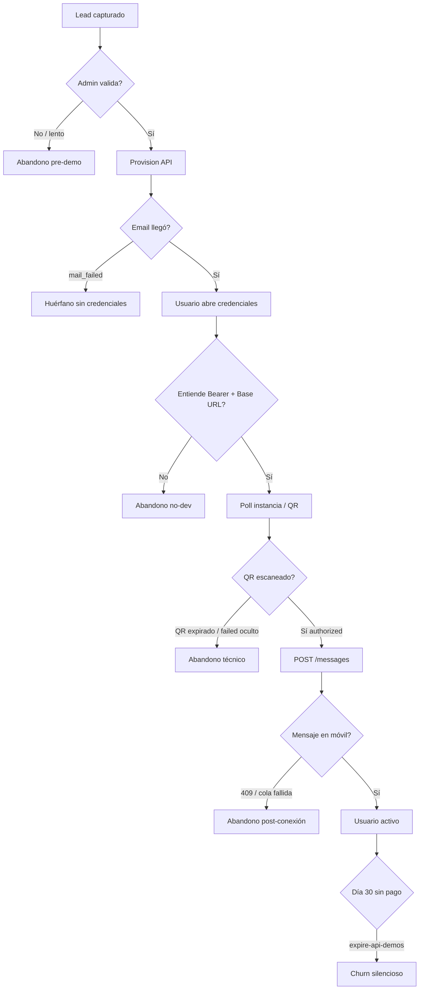

# Auditoría técnica — Churn y retención (WhatsApp API SaaS)

**Fecha:** 2026-07-06  
**Alcance:** `WhatsApiLebytek` (api.lebytek.com) + `Lebytek_Framework` (lebytek.com / waapi.lebytek.com)  
**Rama de referencia:** `feature/backoffice-api-integration` (Framework)  
**Metodología:** Revisión de código, esquema BD, documentación, flujos E2E y checklist VPS — sin cambios en producción.

---

## Resumen ejecutivo

El producto tiene un **núcleo técnico funcional** (provisionar tenant → instancia async → QR → webhook de autorización → envío de mensajes), pero la **instrumentación de retención está en fase temprana**. Hoy es posible perder usuarios en la demo o tras el pago sin que el sistema lo detecte, alerte o recupere.

### Diagnóstico en una frase

> El mayor riesgo de churn no es la API en sí, sino **la brecha entre “credenciales enviadas” y “primer mensaje enviado”**, combinada con **cero visibilidad operativa** del embudo y **estados de cliente incompletos** (demo / activo / vencido / cancelado).

### Madurez por área (1–5)

| Área | Nota | Impacto churn |
|------|------|---------------|
| Onboarding técnico (API) | 3/5 | Alto — async, QR 20s, smoke E2E incompleto |
| Onboarding comercial (Framework) | 2/5 | Alto — validación manual, email único, sin nurture |
| DX (docs + ejemplos) | 3/5 | Medio — contrato sólido, falta guía “5 min al primer mensaje” |
| Errores accionables | 2/5 | Alto — sin `errorCode`, `lastError` oculto en API |
| Métricas / analytics | 1/5 | Crítico — casi nada cableado |
| Alertas preventivas | 0/5 | Crítico — no implementadas |
| Seguridad base | 4/5 | Bajo churn directo; `is_active` no enforced es riesgo operativo |
| Portal cliente (waapi) | 2/5 | Alto — dashboard frágil, uso stub |

### Hallazgo bloqueante de producto

En `docs/integration/VPS_CHECKLIST.md` los pasos **2 y 3 del smoke E2E** (QR en móvil + mensaje recibido) siguen **sin marcar** a fecha de auditoría. Si el equipo no ha validado ese camino en producción, **cualquier usuario nuevo puede encontrar el mismo fallo sin diagnóstico**.

---

## Hallazgos críticos

### C1 — Sin telemetría de embudo (demo → QR → autorizado → primer mensaje)

**Evidencia:**
- `TenantUsageService` (`app/Services/TenantUsageService.php`) existe pero **no se invoca** desde `TransactionalMessageJob` ni ningún controlador.
- Tabla `int_webhooks` migrada (`2026_07_02_100001_create_int_webhooks_table.php`) pero `IncomingWebhookController` **no persiste** payloads — solo procesa `stateInstanceChanged`.
- `core_tenants` no tiene `first_authorized_at`, `first_message_sent_at`, `last_activity_at`.
- Framework `dom_mkt_leads` no distingue “credenciales recibidas” vs “WhatsApp conectado” vs “primer mensaje”.

**Riesgo churn:** No se puede medir ni intervenir en usuarios estancados. Imposible calcular retención real o cohortes.

---

### C2 — Smoke E2E de valor incompleto en producción

**Evidencia:** `docs/integration/VPS_CHECKLIST.md` § Remediación Fase 2a:
- Paso 2: Cliente autoriza WhatsApp (QR) → `[ ]`
- Paso 3: `POST /messages` → WhatsApp en móvil → `[ ]`

**Riesgo churn:** El momento de máxima fricción (QR + primer envío) **no está verificado** como confiable en VPS.

---

### C3 — Fallos de provisioning invisibles para el cliente

**Evidencia:**
- `int_instancias.last_error` se escribe en `ProvisionGreenInstanceJob` (L87) y `DeleteGreenInstanceJob`.
- `InstanceResource` (`app/Http/Resources/Api/V1/InstanceResource.php`) **no expone** `lastError` — solo `status`, `greenState`, fechas.
- Portal waapi muestra `status` pero sin detalle de error cuando `status=failed`.

**Riesgo churn:** Usuario ve “failed” o pantalla vacía sin saber si reintentar, contactar soporte o esperar.

---

### C4 — Dashboard del portal sin manejo de errores de API

**Evidencia:** `WaapiPortalController::dashboard()` (L64–66) llama `listInstances()` **sin try/catch**. Si api está caída o el token revocado → excepción no capturada → probable HTTP 500.

Comparar con `qr()` (L102–104) que sí captura `LebytekApiException`.

**Riesgo churn:** El usuario acaba de pegar su token, entra al panel y ve error genérico del servidor — abandono inmediato.

---

### C5 — Estado `mail_failed` deja recursos huérfanos y bloquea re-provision

**Evidencia:** `LeadApiProvisioningService` crea tenant + instancia + token en api y luego envía correo. Si SMTP falla, marca error pero **no revierte** recursos API. `provisionLead` no reintenta si `api_tenant_public_id` ya está poblado.

**Recuperación manual:** `scripts/resend-lead-credentials.php` (Framework).

**Riesgo churn:** Usuario aprobado que nunca recibe credenciales; admin ve error pero el lead queda en limbo.

---

### C6 — `is_active` del tenant no se valida en la API

**Evidencia:**
- `core_tenants.is_active` existe y se puede parchear vía `TenantProvisioningService::update()`.
- Ningún middleware ni `MessageSendService` / `InstanceController` consulta `is_active` antes de servir.
- Grep en `app/` de WhatsApiLebytek: solo `TenantResource`, modelo y provisioning — **sin enforcement**.

**Riesgo churn/ops:** Cliente “dado de baja” sigue consumiendo API; métricas de churn comercial no coinciden con uso real.

---

### C7 — Sin modelo de conversión demo → pago → cliente activo

**Evidencia:**
- Estados de lead en `config/cruds/mkt_leads.json`: `pendiente`, `validada`, `demo_enviada`, `demo_baja_*`, `rechazada` — **no hay** `cliente_activo`, `vencido`, `cancelado`.
- `dom_mkt_paquetes` es CMS de precios; sin checkout ni vínculo a tenant API.
- API no tiene tablas de suscripción ni `demo_expires_at` por tenant.

**Riesgo churn:** Imposible medir conversión demo→pago ni aplicar políticas distintas por segmento.

---

## Hallazgos medios

### M1 — Errores JSON sin código estable

**Evidencia:** Contrato en `waapi-api-contract.md` documenta códigos HTTP pero las respuestas usan solo `{ "message": "..." }` vía `abort()`. Sin campo `errorCode` / `type` / `action`.

Ejemplos concretos:
- `MessageSendService::queueOutbound()` → `409` con texto `"Instance not authorized for sending."`
- `InstanceController::qr()` → `409` con `"Instance already authorized"` o estado no listo

**Impacto:** Integradores deben parsear strings en inglés; difícil automatizar recuperación (p. ej. redirigir a QR).

---

### M2 — QR con TTL corto (20s) y sin tests

**Evidencia:** `InstanceController::qr()` L109: `$expiresAt = now()->addSeconds(20)`.

Portal `waapi/qr.php` hace polling cada 5s pero **no refresca el QR** automáticamente como `wa_activar.php` (legacy, refresh cada 20s).

**Impacto:** Usuario móvil lento escanea QR expirado → frustración sin mensaje claro de “genera nuevo QR”.

---

### M3 — Token de un solo uso sin autoservicio

**Evidencia:**
- `POST /tenants/{publicId}/tokens` devuelve token en claro una vez (`TenantTokenService::issue()`).
- Email `lead_api_credentials.php` advierte que no se vuelve a mostrar.
- No hay endpoint ni flujo de rotación para el cliente final.

**Impacto:** Pérdida de token = ticket de soporte; fricción alta en demo.

---

### M4 — Dos flujos de activación en paralelo (confusión)

| Flujo | Ruta | Stack |
|-------|------|-------|
| API (actual) | Token → api / waapi portal | `LeadApiProvisioningService` |
| Legacy Green | `/wa/activar/{token}` | `IntegrationsController` + `int_accounts` |

**Impacto:** Operadores y docs pueden mezclar caminos; UX superior en legacy (`wa_activar.php`) no portada al portal waapi.

---

### M5 — Demo expira a los 30 días sin aviso

**Evidencia:** `scripts/expire-api-demos.php` cron diario 03:00 → `LeadApiDeprovisioningService::expireDemosOlderThanDays(30)`.

No hay emails de “demo expira en 7/3/1 días”. Tabla `dom_mkt_secuencias` existe pero **sin ejecutor** en código.

---

### M6 — Panel de uso es placeholder

**Evidencia:** `WaapiPortalController::uso()` fuerza `usageAvailable: false`, `messagesSent: null`.

Contrato API promete panel de “consumo, fallos” pero no hay `GET /messages` (listado) ni endpoint de usage.

---

### M7 — Validación manual del lead (`pendiente` → `validada`)

**Evidencia:** Botón “Provisionar demo (api)” visible solo con `estado=validada` (`mkt_leads.json` L47).

**Impacto:** Time-to-value depende de un humano; leads calientes se enfrían.

---

### M8 — Logging de debug en cliente API de producción

**Evidencia:** `LebytekApiClient.php` L187 escribe en `debug-096fc6.log` en errores de `/tokens`.

**Impacto:** Ruido operativo y posible fuga de metadata sensible (prioridad seguridad media-alta).

---

## Hallazgos menores

| ID | Hallazgo | Ubicación |
|----|----------|-----------|
| n1 | Crontab duplicado (health + expire ×2) | `VPS_CHECKLIST.md` L59–59 |
| n2 | Stub docs `role-delegation-waapi.md`, `waapi-implementation-real.md` | `docs/integration/` |
| n3 | `docs/guides/portal-cliente-waapi.md` referenciado en api pero ausente en Framework | `.env.example` Framework |
| n4 | `PUT /credentials/green-api` devuelve 501 | `CredentialsController` |
| n5 | `horizon:snapshot` configurado pero sin `Schedule::` en `routes/console.php` | API |
| n6 | Portal acceso redirige sin token a `lebytek.com` (incorrecto en host waapi) | `waapi/acceso.php` |
| n7 | `WAAPI_PORTAL_ENABLED=true` desactiva captura `POST /lead` en raíz | `routes/web.php` |
| n8 | Login portal: mismo mensaje para token inválido, API caída o sin instancias | `WaapiPortalSession::login()` |
| n9 | JS de polling QR traga errores en `catch` vacío | `waapi/qr.php`, `wa_activar.php` |
| n10 | Sin tests Pest para `InstanceController::qr()` ni webhooks | `tests/Feature/Api/` |

---

## Riesgos concretos de churn (mapa usuario → abandono)



| Momento | Síntoma usuario | Causa raíz en código | Severidad |
|---------|-----------------|----------------------|-----------|
| Post-solicitud | “Nadie me contactó” | Estado `pendiente` sin SLA/automation | Alta |
| Post-aprobación | No llegó el correo | SMTP + no rollback de provision | Crítica |
| Primer login portal | Error 500 | `dashboard()` sin try/catch | Crítica |
| Escaneo QR | QR no funciona | TTL 20s, sin refresh en waapi | Alta |
| Instancia failed | Pantalla sin explicación | `lastError` no en API resource | Alta |
| Primer mensaje | 409 sin guía | `MessageSendService` abort genérico | Alta |
| Día 7–30 demo | Corte repentino | Cron expire sin warning | Alta |
| Post-pago | Sin upgrade en sistema | No existe estado `cliente_activo` | Estratégica |

---

## Recomendaciones técnicas

### API (WhatsApiLebytek)

1. **Middleware `EnsureTenantActive`** — rechazar requests si `tenant.is_active === false` (excepto platform admin). Archivo sugerido: `app/Http/Middleware/EnsureTenantActive.php`, registrar en grupo `api` v1.

2. **Exponer `lastError` condicionalmente** en `InstanceResource` cuando `status === 'failed'`:
   ```php
   'lastError' => $this->when($this->status === 'failed', $this->last_error),
   ```

3. **Enriquecer errores 409** en `MessageSendService` y `InstanceController::qr()`:
   ```json
   {
     "message": "Instance not authorized for sending.",
     "errorCode": "INSTANCE_NOT_AUTHORIZED",
     "action": "GET /instances/{publicId} until status is authorized"
   }
   ```

4. **Cablear `TenantUsageService::increment()`** en `TransactionalMessageJob` tras envío exitoso; persistir snapshot diario en BD (ver tablas propuestas).

5. **Persistir webhooks** en `int_webhooks` antes de procesar en `IncomingWebhookController::__invoke()`.

6. **Añadir milestones en `core_tenants`** (migración): `first_qr_fetched_at`, `first_authorized_at`, `first_message_sent_at`, `last_api_activity_at`.

7. **Endpoint `GET /messages`** con paginación — requerido por contrato y portal waapi.

8. **Tests de integración** para QR y webhook `stateInstanceChanged`.

9. **Eliminar** escritura a `debug-096fc6.log` en `LebytekApiClient.php`; usar logger estándar sin tokens.

### Framework (Lebytek_Framework)

1. **try/catch en `WaapiPortalController::dashboard()`** — mismo patrón que `qr()`; vista con error accionable.

2. **Estados de lead ampliados:** `cliente_activo`, `cliente_vencido`, `cliente_cancelado` + fechas `demo_expires_at`, `converted_at`, `cancelled_at`.

3. **Webhook o polling de lifecycle:** cuando API marca instancia `authorized`, actualizar lead y disparar email “Ya estás conectado — envía tu primer mensaje”.

4. **Secuencia pre-expiración:** ejecutor para `dom_mkt_secuencias` o script `warn-expiring-demos.php` (D-7, D-3, D-1).

5. **Transacción compensatoria** en `LeadApiProvisioningService`: si email falla, marcar lead con estado recuperable y alerta admin; opcional deprovision async.

6. **Unificar UX QR** del portal waapi con mejoras de `wa_activar.php` (refresh QR, fases claras).

7. **Deprecar formalmente** flujo legacy `/wa/activar` cuando smoke API esté verde.

---

## Recomendaciones de onboarding

### Flujo objetivo “Time to first message < 15 min”

| Paso | Actor | Acción | Artefacto |
|------|-------|--------|-----------|
| 0 | Sistema | Auto-validar leads con dominio corporativo / score | Regla en `CapturarLeadUseCase` |
| 1 | Admin o auto | `validada` → provision | CRUD / webhook interno |
| 2 | Email | Credenciales + **link directo** `/portal/qr` con token en query firmado (opcional) o CTA panel | `lead_api_credentials.php` |
| 3 | Portal | Wizard 3 pantallas: Conectar → Escanear → Probar envío | Nuevo flujo waapi |
| 4 | API | Smoke automático post-provision (health instancia) | Job o script |
| 5 | Email T+2h | Si no `authorized` → “¿Necesitas ayuda con el QR?” | Secuencia |
| 6 | Email T+24h | Si no `first_message` → ejemplo curl listo | Secuencia |

### Contenido mínimo del correo de credenciales (hoy incompleto)

El template actual (`lead_api_credentials.php`) lista pasos genéricos pero **no incluye**:
- `curl` copy-paste con Base URL + token del lead
- Link directo al panel QR (`MKT_EMAIL_DASHBOARD_URL` es opcional)
- Número de soporte con SLA (“respondemos en X h”)

### Sandbox / demo controlada

- Marcar instancias con `purpose=demo` (ya existe en `int_instancias.purpose`).
- Falta: **límite de mensajes demo** (p. ej. 50/mes) usando `TenantUsageService` + respuesta `429` con `errorCode: DEMO_QUOTA_EXCEEDED`.
- Falta: **número de prueba sugerido** en docs (formato E.164).

---

## Recomendaciones de documentación

| Prioridad | Acción | Archivo destino |
|-----------|--------|-----------------|
| P0 | Guía “Primer mensaje en 5 minutos” con curl + Postman collection | `docs/guides/quickstart-first-message.md` |
| P0 | Documentar todos los `errorCode` cuando se implementen | `waapi-api-contract.md` § Errores |
| P1 | Completar stub `waapi-implementation-real.md` o eliminarlo | Framework `docs/integration/` |
| P1 | Sincronizar `portal-cliente-waapi.md` en ambos repos | api `docs/guides/`, Framework |
| P1 | Tabla de estados instancia + acciones recomendadas | Contrato API |
| P2 | OpenAPI/Scribe al día con ejemplos reales de respuesta 409/422 | Deploy api `/docs` |
| P2 | Runbook “lead mail_failed” para admins | `lebytek-implementation-real.md` |

**Desalineación doc vs código detectada:**
- Contrato menciona panel de consumo → `uso()` es stub.
- Contrato menciona 429 → limiter definido en `AppServiceProvider` pero sin tests E2E de throttle.
- VPS checklist dice provisioning verde pero QR+mensaje pendientes.

---

## Propuesta de estructura de tablas para métricas

> API y Framework usan **bases de datos separadas**. Las métricas de negocio viven principalmente en Framework; las de uso técnico en API. Sincronizar vía API platform (`listTenants`, agregados) o job nocturno.

### Framework — `dom_mkt_leads` (extensión)

```sql
ALTER TABLE dom_mkt_leads
  ADD COLUMN demo_started_at       DATETIME NULL COMMENT 'api_provisioned_at alias lógico',
  ADD COLUMN demo_expires_at       DATETIME NULL COMMENT 'demo_started_at + N días',
  ADD COLUMN converted_at          DATETIME NULL,
  ADD COLUMN cancelled_at          DATETIME NULL,
  ADD COLUMN cancellation_reason   VARCHAR(255) NULL,
  ADD COLUMN first_api_request_at  DATETIME NULL,
  ADD COLUMN first_authorized_at   DATETIME NULL COMMENT 'sync desde API/webhook',
  ADD COLUMN first_message_sent_at DATETIME NULL,
  ADD COLUMN last_activity_at      DATETIME NULL,
  ADD COLUMN plan_slug             VARCHAR(50) NULL,
  ADD COLUMN mrr_cents             INT UNSIGNED NULL,
  ADD KEY idx_mkt_leads_demo_expires (demo_expires_at),
  ADD KEY idx_mkt_leads_last_activity (last_activity_at);
```

Nuevos valores de `estado`: `cliente_activo`, `cliente_vencido`, `cliente_cancelado`.

### Framework — snapshots mensuales de churn

```sql
CREATE TABLE rep_churn_monthly (
  id                    BIGINT UNSIGNED AUTO_INCREMENT PRIMARY KEY,
  period_year           SMALLINT NOT NULL,
  period_month          TINYINT NOT NULL,
  clients_start         INT UNSIGNED NOT NULL COMMENT 'Activos al 1er día del mes (sin nuevos del mes)',
  clients_lost          INT UNSIGNED NOT NULL COMMENT 'Cancelados + vencidos en el mes',
  churn_rate_pct        DECIMAL(6,3) NOT NULL,
  demos_started         INT UNSIGNED NOT NULL DEFAULT 0,
  demos_converted       INT UNSIGNED NOT NULL DEFAULT 0,
  demo_conversion_pct   DECIMAL(6,3) NULL,
  active_by_usage       INT UNSIGNED NOT NULL DEFAULT 0 COMMENT '>=1 mensaje o API call en ventana',
  at_risk_count         INT UNSIGNED NOT NULL DEFAULT 0,
  net_new_clients       INT UNSIGNED NOT NULL DEFAULT 0 COMMENT 'Adquisición, NO entra en churn',
  calculated_at         DATETIME NOT NULL DEFAULT CURRENT_TIMESTAMP,
  UNIQUE KEY uq_period (period_year, period_month)
) ENGINE=InnoDB DEFAULT CHARSET=utf8mb4;
```

### Framework — señales de riesgo (alertas)

```sql
CREATE TABLE rep_risk_signals (
  id              BIGINT UNSIGNED AUTO_INCREMENT PRIMARY KEY,
  lead_id         BIGINT UNSIGNED NULL,
  tenant_public_id CHAR(26) NULL,
  signal_type     VARCHAR(64) NOT NULL,
  severity        ENUM('low','medium','high') NOT NULL DEFAULT 'medium',
  payload_json    JSON NULL,
  detected_at     DATETIME NOT NULL DEFAULT CURRENT_TIMESTAMP,
  resolved_at     DATETIME NULL,
  notified_at     DATETIME NULL,
  KEY idx_risk_open (resolved_at, signal_type),
  KEY idx_risk_tenant (tenant_public_id)
);
```

`signal_type` sugeridos: `demo_no_activity_48h`, `token_never_used`, `instance_no_qr`, `qr_not_connected`, `repeated_api_errors`, `no_messages_7d`, `usage_drop_50pct`, `demo_expiring_7d`.

### Framework — actividad diaria (rollup)

```sql
CREATE TABLE rep_lead_activity_daily (
  id                    BIGINT UNSIGNED AUTO_INCREMENT PRIMARY KEY,
  activity_date         DATE NOT NULL,
  lead_id               BIGINT UNSIGNED NOT NULL,
  api_requests          INT UNSIGNED NOT NULL DEFAULT 0,
  messages_sent         INT UNSIGNED NOT NULL DEFAULT 0,
  api_errors            INT UNSIGNED NOT NULL DEFAULT 0,
  UNIQUE KEY uq_lead_day (activity_date, lead_id)
) ENGINE=InnoDB DEFAULT CHARSET=utf8mb4;
```

### API — `core_tenants` (extensión)

```sql
ALTER TABLE core_tenants
  ADD COLUMN first_authorized_at   TIMESTAMP NULL,
  ADD COLUMN first_message_sent_at TIMESTAMP NULL,
  ADD COLUMN last_api_activity_at  TIMESTAMP NULL,
  ADD COLUMN demo_expires_at       TIMESTAMP NULL,
  ADD COLUMN commercial_status     VARCHAR(30) NOT NULL DEFAULT 'demo'
    COMMENT 'demo|active|past_due|cancelled';
```

### API — eventos de uso (alternativa a solo Redis)

```sql
CREATE TABLE rep_tenant_usage_daily (
  id              BIGINT UNSIGNED AUTO_INCREMENT PRIMARY KEY,
  tenant_id       BIGINT UNSIGNED NOT NULL,
  usage_date      DATE NOT NULL,
  messages_sent   INT UNSIGNED NOT NULL DEFAULT 0,
  messages_failed INT UNSIGNED NOT NULL DEFAULT 0,
  api_requests    INT UNSIGNED NOT NULL DEFAULT 0,
  UNIQUE KEY uq_tenant_day (tenant_id, usage_date),
  KEY idx_usage_date (usage_date)
) ENGINE=InnoDB DEFAULT CHARSET=utf8mb4;
```

### Eventos a instrumentar (código)

| Evento | Dónde capturar | Campo destino |
|--------|----------------|---------------|
| Token emitido | `TenantTokenService::issue()` | lead `demo_started_at` (webhook interno) |
| Primera request API | Middleware `TrackTenantActivity` | `last_api_activity_at` |
| QR obtenido | `InstanceController::qr()` | `first_qr_fetched_at` |
| Instancia authorized | `IncomingWebhookController` | `first_authorized_at` |
| Mensaje enviado OK | `TransactionalMessageJob` | `first_message_sent_at`, usage daily |
| Mensaje fallido | `TransactionalMessageJob` catch | `messages_failed`, risk signal |
| Demo convertida | Admin CRUD / futuro billing | `converted_at`, `estado=cliente_activo` |
| Demo expirada | `expire-api-demos.php` | `cancelled_at`, churn |

---

## Propuesta de cron job en PHP (cálculo mensual)

**Ubicación sugerida:** `Lebytek_Framework/scripts/calculate-monthly-churn.php`  
**Schedule:** `5 4 1 * *` (día 1 de cada mes, 04:05) — después del expire diario.

### Definiciones (cohorte de churn)

- **Cliente activo al inicio del mes:** `estado IN ('cliente_activo','demo_enviada')` con `demo_expires_at > primer_día` OR `plan_slug IS NOT NULL`, excluyendo creados ese mes.
- **Cliente perdido en el mes:** pasó a `cliente_cancelado`, `cliente_vencido` o `demo_baja` durante el mes, **sin contar** altas del mismo mes.
- **Demo iniciada:** `demo_started_at` (o `api_provisioned_at`) cae en el mes.
- **Demo convertida:** `converted_at` en el mes y estado `cliente_activo`.
- **Activo por uso:** `last_activity_at >= NOW() - 30 days` AND al menos 1 mensaje en API (consulta agregada).

### Pseudocódigo PHP

```php
<?php
// scripts/calculate-monthly-churn.php
declare(strict_types=1);

define('ROOT_PATH', dirname(__DIR__));
require ROOT_PATH.'/vendor/autoload.php';

use Lebytek\Framework\Kernel\Database\Connection;
// ... bootstrap igual que expire-api-demos.php

$periodStart = new DateTimeImmutable('first day of last month 00:00:00');
$periodEnd   = new DateTimeImmutable('last day of last month 23:59:59');
$year  = (int) $periodStart->format('Y');
$month = (int) $periodStart->format('n');

$pdo = Connection::getInstance();

// 1) Clientes activos al inicio (excluir creados en el mes)
$clientsStart = (int) $pdo->query("
    SELECT COUNT(*) FROM dom_mkt_leads
    WHERE deleted = 0
      AND estado IN ('demo_enviada', 'cliente_activo')
      AND COALESCE(demo_started_at, api_provisioned_at, created_at) < '{$periodStart->format('Y-m-d')}'
      AND (demo_expires_at IS NULL OR demo_expires_at >= '{$periodStart->format('Y-m-d')}')
      AND (cancelled_at IS NULL OR cancelled_at >= '{$periodStart->format('Y-m-d')}')
")->fetchColumn();

// 2) Perdidos en el periodo (NO nuevos del mes)
$clientsLost = (int) $pdo->query("
    SELECT COUNT(*) FROM dom_mkt_leads
    WHERE deleted = 0
      AND (
        (estado IN ('demo_baja','cliente_cancelado','cliente_vencido')
         AND updated_at BETWEEN '{$periodStart->format('Y-m-d')}' AND '{$periodEnd->format('Y-m-d')}')
      )
      AND COALESCE(demo_started_at, api_provisioned_at, created_at) < '{$periodStart->format('Y-m-d')}'
")->fetchColumn();

$churnRate = $clientsStart > 0
    ? round(($clientsLost / $clientsStart) * 100, 3)
    : 0.0;

// 3) Demos del mes
$demosStarted = (int) $pdo->query("
    SELECT COUNT(*) FROM dom_mkt_leads
    WHERE deleted = 0
      AND api_provisioned_at BETWEEN '{$periodStart->format('Y-m-d')}' AND '{$periodEnd->format('Y-m-d')}'
")->fetchColumn();

$demosConverted = (int) $pdo->query("
    SELECT COUNT(*) FROM dom_mkt_leads
    WHERE deleted = 0
      AND converted_at BETWEEN '{$periodStart->format('Y-m-d')}' AND '{$periodEnd->format('Y-m-d')}'
")->fetchColumn();

$demoConversionPct = $demosStarted > 0
    ? round(($demosConverted / $demosStarted) * 100, 3)
    : null;

// 4) Activos por uso real (últimos 30d del cierre de mes)
$activeByUsage = (int) $pdo->query("
    SELECT COUNT(*) FROM dom_mkt_leads
    WHERE deleted = 0
      AND estado IN ('demo_enviada','cliente_activo')
      AND last_activity_at >= DATE_SUB('{$periodEnd->format('Y-m-d')}', INTERVAL 30 DAY)
")->fetchColumn();

// 5) En riesgo (reglas § Alertas — conteo snapshot)
$atRisk = (int) $pdo->query("
    SELECT COUNT(DISTINCT lead_id) FROM rep_risk_signals
    WHERE resolved_at IS NULL
      AND detected_at <= '{$periodEnd->format('Y-m-d 23:59:59')}'
")->fetchColumn();

// 6) Net new (adquisición — NO churn)
$netNew = (int) $pdo->query("
    SELECT COUNT(*) FROM dom_mkt_leads
    WHERE deleted = 0
      AND estado IN ('demo_enviada','cliente_activo')
      AND COALESCE(demo_started_at, api_provisioned_at) BETWEEN '{$periodStart->format('Y-m-d')}' AND '{$periodEnd->format('Y-m-d')}'
")->fetchColumn();

// 7) Persistir
$stmt = $pdo->prepare('
    INSERT INTO rep_churn_monthly (
      period_year, period_month, clients_start, clients_lost, churn_rate_pct,
      demos_started, demos_converted, demo_conversion_pct,
      active_by_usage, at_risk_count, net_new_clients
    ) VALUES (?,?,?,?,?,?,?,?,?,?,?)
    ON DUPLICATE KEY UPDATE
      clients_start=VALUES(clients_start), clients_lost=VALUES(clients_lost),
      churn_rate_pct=VALUES(churn_rate_pct), calculated_at=NOW()
');
$stmt->execute([
    $year, $month, $clientsStart, $clientsLost, $churnRate,
    $demosStarted, $demosConverted, $demoConversionPct,
    $activeByUsage, $atRisk, $netNew,
]);

// 8) Opcional: enriquecer messages_sent desde API
// LebytekApiClient::listTenants() + agregados o endpoint futuro GET /admin/metrics

fwrite(STDOUT, json_encode(compact(
    'year','month','clientsStart','clientsLost','churnRate',
    'demosStarted','demosConverted','activeByUsage','atRisk','netNew'
), JSON_PRETTY_PRINT)."\n");
```

### Cron complementario diario — detección de riesgo

**Script:** `scripts/detect-at-risk-users.php` (Framework)  
**Schedule:** `0 8 * * *`  
Consulta leads + API (instancia status, logs) y escribe en `rep_risk_signals`; dispara email interno si `severity=high`.

---

## Fórmulas SaaS recomendadas

| Métrica | Fórmula | Notas para este proyecto |
|---------|---------|--------------------------|
| **Churn rate mensual (logo)** | `clientes_perdidos_en_el_periodo / clientes_activos_al_inicio_del_periodo × 100` | Excluir altas del mes del denominador |
| **Net new clients** | `altas_demo_o_pago_en_el_periodo` | Medir en `rep_churn_monthly.net_new_clients` |
| **Demo → pago conversion** | `demos_convertidas / demos_iniciadas × 100` | Requiere `converted_at` |
| **Activation rate** | `usuarios_con_primer_mensaje / demos_iniciadas × 100` | Usar `first_message_sent_at` |
| **Time to activate (median)** | `median(first_authorized_at - demo_started_at)` | KPI onboarding |
| **Time to first message (median)** | `median(first_message_sent_at - demo_started_at)` | North star dev-first |
| **DAU/MAU (stickiness)** | `DAU / MAU` | Con `rep_lead_activity_daily` |
| **Logo retention (cohorte)** | `clientes_cohorte_activos_mes_n / clientes_cohorte_mes_0` | Por mes de `demo_started_at` |
| **NRR (futuro)** | `(MRR_inicio + expansion - contraction - churn) / MRR_inicio × 100` | Cuando exista `mrr_cents` |
| **GRR** | `(MRR_inicio - contraction - churn) / MRR_inicio × 100` | Sin expansion |

---

## Alertas preventivas — reglas propuestas

| Regla | Condición | Ventana | Acción |
|-------|-----------|---------|--------|
| Demo sin actividad | `api_provisioned_at` set, `last_activity_at` NULL | +48h | Email ayuda + signal `demo_no_activity_48h` |
| Token sin uso | Token emitido, 0 requests en API | +24h | Email “¿Problemas con el token?” |
| Instancia sin QR | `status=waiting_qr`, nunca `GET .../qr` | +12h | Push admin + email cliente con link panel |
| QR no conectado | QR fetched, `status != authorized` | +24h | Email troubleshooting QR |
| Errores repetidos | `api_errors >= 5` en 1h | rolling 1h | Signal `repeated_api_errors`, ticket soporte |
| Sin mensajes | `authorized` pero `first_message_sent_at` NULL | +72h | Email con curl de ejemplo |
| Caída de uso | `messages_sent` semana actual < 50% semana anterior | 7d | CSM outreach (clientes de pago) |
| Demo por vencer | `demo_expires_at` en 7 días, sin `converted_at` | D-7, D-3, D-1 | Email upgrade + oferta |
| Instancia desconectada | Webhook `notAuthorized` tras `authorized` | inmediato | Email + webhook opcional al cliente |

**Implementación mínima:** script diario que lee `dom_mkt_leads` + llama API `GET /instances` con token plataforma + inserta en `rep_risk_signals` + cola de email (`MarketingCorreoSettingsProvider`).

---

## Checklist priorizado de implementación

### P0 — Bloquea medición y recuperación
- [ ] Completar smoke VPS pasos 2–3 (QR + mensaje móvil)
- [ ] try/catch en `WaapiPortalController::dashboard()`
- [ ] Exponer `lastError` en instancias failed
- [ ] Middleware `EnsureTenantActive`
- [ ] Campos `first_*` y `last_activity_at` en lead/tenant
- [ ] Cablear `TenantUsageService` + persistencia diaria

### P1 — Reduce churn demo
- [ ] Guía quickstart + curl en email credenciales
- [ ] Refresh QR en portal waapi
- [ ] `errorCode` en respuestas 409/422 críticas
- [ ] Emails pre-expiración demo (D-7, D-3, D-1)
- [ ] Estados `cliente_activo` / `cancelado` / `vencido`
- [ ] Script `detect-at-risk-users.php`

### P2 — Métricas y estrategia
- [ ] Tablas `rep_churn_monthly`, `rep_risk_signals`, `rep_lead_activity_daily`
- [ ] Cron `calculate-monthly-churn.php`
- [ ] `GET /messages` + panel uso real
- [ ] Webhook Framework ← API (authorized / first message)
- [ ] Deprecar flujo legacy `/wa/activar`
- [ ] Ejecutor `dom_mkt_secuencias`

### P3 — Escala
- [ ] Cuotas demo con `429 DEMO_QUOTA_EXCEEDED`
- [ ] NRR / billing integrado
- [ ] OpenAPI completo + Postman public
- [ ] Sentry / APM en api y Framework

---

## Quick wins (< 1 día)

| # | Tarea | Repo | Esfuerzo |
|---|-------|------|----------|
| 1 | try/catch `dashboard()` + vista error amigable | Framework | 1h |
| 2 | Añadir `lastError` a `InstanceResource` si failed | API | 30m |
| 3 | Ejemplo curl en `lead_api_credentials.php` | Framework | 1h |
| 4 | Forzar `MKT_EMAIL_DASHBOARD_URL` en producción | VPS env | 15m |
| 5 | Eliminar `debug-096fc6.log` en `LebytekApiClient` | Framework | 15m |
| 6 | Documentar runbook `mail_failed` en checklist | docs | 1h |
| 7 | Ejecutar smoke manual y documentar en VPS_CHECKLIST | ops | 2h |
| 8 | Limpiar crontab duplicado | VPS | 15m |

---

## Mejoras importantes (1 semana)

| # | Tarea | Impacto |
|---|-------|---------|
| 1 | Migración campos lifecycle en `dom_mkt_leads` + estados nuevos | Conversión medible |
| 2 | Middleware actividad + `last_api_activity_at` | Riesgo detectable |
| 3 | `detect-at-risk-users.php` + tabla `rep_risk_signals` | Alertas |
| 4 | Emails secuencia demo (sin actividad, pre-expire) | Retención demo |
| 5 | Portal QR con refresh automático | Activación |
| 6 | `errorCode` en 409 mensajes/QR | DX |
| 7 | `GET /messages` paginado | Portal + soporte |
| 8 | Tests Pest QR + webhook | Confianza deploy |
| 9 | `EnsureTenantActive` middleware | Seguridad/comercial |
| 10 | Quickstart doc + sync docsV2 | Onboarding dev |

---

## Mejoras estratégicas (1 mes)

| # | Iniciativa | Resultado esperado |
|---|------------|-------------------|
| 1 | Wizard onboarding waapi (conectar → QR → test message) | TTFM < 15 min |
| 2 | Pipeline métricas: cron mensual churn + dashboard admin | Decisiones data-driven |
| 3 | Webhooks bidireccionales api ↔ Framework (lifecycle) | Estado único cliente |
| 4 | Cuotas y planes (`commercial_status` + límites) | Monetización clara |
| 5 | Autovalidación leads + provision SLA < 1h | Menos abandono pre-demo |
| 6 | Rotación self-service de token (con email confirmación) | Menos tickets |
| 7 | Cohort retention dashboard (rep_churn_monthly + BI) | Churn por cohorte visible |
| 8 | Cerrar legacy Green path | Una sola verdad operativa |
| 9 | Integración Sentry + alertas Horizon failed jobs | MTTR bajo |
| 10 | NRR cuando exista facturación (`mrr_cents`) | Métrica SaaS madura |

---

## Referencias de código auditado

### API — rutas principales (`routes/api.php`)

- Health, tenants, instances, messages, webhooks incoming
- Permisos: `config/permissions.php` → `demo_client_abilities`

### API — servicios críticos

| Servicio | Archivo |
|----------|---------|
| Provision tenant | `app/Services/TenantProvisioningService.php` |
| Token cliente | `app/Services/TenantTokenService.php` |
| Provision instancia | `app/Services/GreenApi/InstanceProvisioningService.php` |
| Envío mensajes | `app/Services/Messaging/MessageSendService.php` |
| Usage (sin cablear) | `app/Services/TenantUsageService.php` |

### Framework — onboarding

| Componente | Archivo |
|------------|---------|
| Provision lead | `app/Application/Marketing/LeadApiProvisioningService.php` |
| Deprovision / expire | `app/Application/Marketing/LeadApiDeprovisioningService.php` |
| Portal waapi | `app/Presentation/Controllers/Publico/WaapiPortalController.php` |
| Cliente API plataforma | `app/Infrastructure/Integrations/LebytekApi/LebytekApiClient.php` |
| Cliente API tenant | `app/Infrastructure/Integrations/LebytekApi/ClientTenantApiClient.php` |
| Expire cron | `scripts/expire-api-demos.php` |
| Reporte lifecycle | `scripts/lead-lifecycle-report.php` |

### Documentación canónica

- `docs/integration/waapi-api-contract.md`
- `docs/integration/role-delegation-lebytek-api.md`
- `docs/integration/VPS_CHECKLIST.md`
- `docs/integration/lebytek-implementation-real.md`

---

## Conclusión

El stack está **listo para demos técnicas controladas** pero **no listo para retener usuarios a escala**. La prioridad absoluta es cerrar el embudo **credenciales → QR → primer mensaje** con smoke verificado, errores accionables y señales de riesgo automáticas. Sin eso, cualquier inversión en marketing generará churn invisible en las primeras 48 horas.

**Siguiente paso recomendado:** ejecutar smoke VPS pasos 2–3, aplicar quick wins 1–3 en el mismo sprint, y desplegar migración mínima de `last_activity_at` + script `detect-at-risk-users.php` antes del próximo lote de demos.

---

*Auditoría generada por revisión estática de código. No se modificó producción ni credenciales.*
