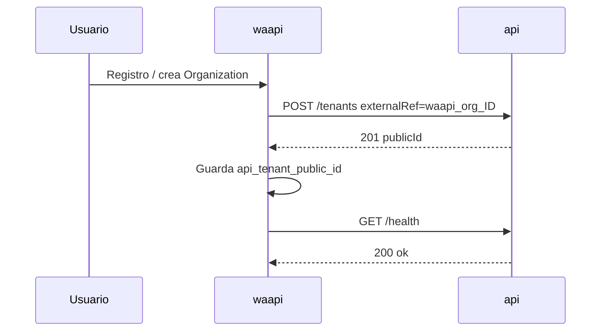

# Contrato API — waapi ↔ api.lebytek.com

Contrato técnico de integración entre el SaaS **waapi.lebytek.com** (Lebytek Framework) y el motor **api.lebytek.com** (WhatsApiLebytek / Laravel).

**Versión:** `v1`  
**Base URL:** `https://api.lebytek.com/api/v1`  
**OpenAPI (Scribe):** `https://api.lebytek.com/docs` (generado en deploy)

---

## Modelo de autenticación

waapi usa **una cuenta de servicio de plataforma** (token Sanctum único). No hay tokens por cliente en fase 1.

| Elemento | Valor |
|----------|-------|
| Header | `Authorization: Bearer {LEBYTEK_API_TOKEN}` |
| Emisión del token | En el VPS api: `php artisan integration:issue-waapi-token` |
| Usuario api | `WAAPI_SERVICE_EMAIL` (platform admin, `tenant_id = null`) |
| Permisos | `api.health`, `tenants.ver`, `tenants.provisionar`, `tenants.gestionar` |

El token se guarda en waapi como `LEBYTEK_API_TOKEN` (secreto, nunca en repositorio).

---

## Headers comunes

| Header | Obligatorio | Uso |
|--------|-------------|-----|
| `Authorization` | Sí | Bearer token de plataforma |
| `Accept` | Sí | `application/json` |
| `Content-Type` | En writes | `application/json` |
| `Idempotency-Key` | POST/PATCH | UUID; requerido en escrituras API |
| `X-Tenant-Id` | Condicional | ULID del tenant (`publicId`) cuando el token es de plataforma y la ruta no incluye el tenant en el path |

### `X-Tenant-Id`

Cuando waapi opera en nombre de un cliente con el token de plataforma:

- En rutas **sin** `{tenant}` en el path (futuro vertical WhatsApp), enviar `X-Tenant-Id: {publicId}`.
- En rutas con `{tenant}` en el path (`/tenants/{publicId}`), el path es suficiente; el header es opcional.
- Si el header apunta a un ULID inexistente → `404`.
- Usuarios no platform ignoran el header (quedan confinados a su `tenant_id`).

---

## Formato de respuesta

- JSON en **camelCase** (API Resources).
- Fechas en ISO 8601.
- Claves públicas de recursos: **ULID** (`publicId`), nunca IDs autoincrementales.
- Paginación Laravel estándar en listados (`data`, `links`, `meta`).

### Errores HTTP

| Código | Significado |
|--------|-------------|
| 401 | Token ausente o inválido |
| 403 | Sin permiso RBAC o sin acceso platform/tenant |
| 404 | Recurso o tenant acting no encontrado |
| 422 | Validación fallida |
| 429 | Rate limit (60 req/min por token/usuario) |

Cuerpo típico 422:

```json
{
  "message": "The slug has already been taken.",
  "errors": {
    "slug": ["The slug has already been taken."]
  }
}
```

---

## Rate limiting

- 60 solicitudes/minuto por combinación `tenant_id:user_id` o IP.
- En `429`, reintentar con backoff exponencial.

---

## Endpoints — Fase 1 (implementados)

### `GET /health`

**Permiso:** `api.health`  
**Idempotency-Key:** no requerido

**Respuesta 200:**

```json
{
  "status": "ok",
  "checks": {
    "database": { "ok": true, "message": "connected" },
    "redis": { "ok": true, "message": "connected" }
  },
  "timestamp": "2026-06-29T12:00:00+00:00",
  "actingTenant": "01JXYZ..."
}
```

`actingTenant` refleja el tenant en contexto (usuario tenant o `X-Tenant-Id`).

---

### `GET /tenants`

**Permiso:** `tenants.ver`  
**Acceso:** solo cuenta de plataforma  
**Query:** `page`, `perPage` (default 15)

**Respuesta 200:** colección paginada de `TenantResource`.

---

### `POST /tenants`

**Permiso:** `tenants.provisionar`  
**Acceso:** solo cuenta de plataforma  
**Idempotency-Key:** requerido

**Body:**

```json
{
  "name": "Acme Corp",
  "slug": "acme-corp",
  "externalRef": "waapi_org_42"
}
```

| Campo | Tipo | Reglas |
|-------|------|--------|
| `name` | string | requerido, max 255 |
| `slug` | string | requerido, `alpha_dash`, único |
| `externalRef` | string | opcional, único; clave de idempotencia waapi |

**Idempotencia por `externalRef`:** si ya existe un tenant con el mismo `externalRef`, devuelve `200` con el tenant existente (no crea duplicado). Creación nueva → `201`.

**Respuesta (TenantResource):**

```json
{
  "publicId": "01JXYZABCDEF",
  "name": "Acme Corp",
  "slug": "acme-corp",
  "externalRef": "waapi_org_42",
  "isActive": true,
  "createdAt": "2026-06-29T12:00:00+00:00",
  "updatedAt": "2026-06-29T12:00:00+00:00"
}
```

waapi debe persistir `publicId` en su tabla `organizations.api_tenant_public_id`.

---

### `GET /tenants/{publicId}`

**Permiso:** `tenants.ver`  
**Acceso:** plataforma (cualquier tenant) o usuario del mismo tenant

---

### `PATCH /tenants/{publicId}`

**Permiso:** `tenants.gestionar`  
**Acceso:** solo cuenta de plataforma  
**Idempotency-Key:** requerido

**Body (parcial):**

```json
{
  "name": "Acme Corp SA",
  "isActive": false
}
```

---

## Webhooks entrantes (Green API → api)

**No consumidos por waapi.** Green API envía eventos solo a api.

| Method | Path | Auth |
|--------|------|------|
| POST | `/api/v1/webhooks/incoming` | HMAC `X-Webhook-Signature` + `X-Event-Id` |

Secreto: `WEBHOOK_SECRET` en `.env` de api.

---

## Endpoints — Fase 2 (planned, no implementados)

Marcados para el vertical WhatsApp. waapi **no debe** implementar llamadas a estos endpoints hasta que aparezcan en OpenAPI.

| Method | Path | Permiso (previsto) | Propósito |
|--------|------|-------------------|-----------|
| GET | `/instances` | `instancias.ver` | Listar instancias Green por tenant |
| POST | `/instances` | `instancias.crear` | Vincular instancia |
| GET | `/instances/{publicId}` | `instancias.ver` | Estado / QR |
| DELETE | `/instances/{publicId}` | `instancias.eliminar` | Desvincular |
| PUT | `/credentials/green-api` | `credenciales.gestionar` | Credenciales cifradas por tenant |
| GET | `/campaigns` | `campanias.ver` | Listar campañas |
| POST | `/campaigns` | `campanias.crear` | Crear campaña |
| POST | `/campaigns/{publicId}/dispatch` | `campanias.enviar` | Despachar cola |
| POST | `/messages` | `mensajes.enviar` | Envío transaccional |
| GET | `/messages/{publicId}` | `mensajes.ver` | Estado de mensaje |

Todas las rutas fase 2 requerirán `X-Tenant-Id` con token de plataforma salvo que el tenant vaya en el path.

---

## Flujo de onboarding (waapi)



---

## Bootstrap en producción (api)

```bash
# Tras migrate/seed
php artisan integration:issue-waapi-token --revoke
# Copiar token → waapi .env LEBYTEK_API_TOKEN
```

Variables api relevantes:

```env
WAAPI_SERVICE_EMAIL=waapi-service@lebytek.internal
WAAPI_SERVICE_NAME="waapi Platform Service"
```

Variables waapi:

```env
LEBYTEK_API_URL=https://api.lebytek.com/api/v1
LEBYTEK_API_TOKEN=<token del comando artisan>
```

---

## Referencias en código

| Componente | Ruta |
|------------|------|
| Rutas | `routes/api.php` |
| Provisioning | `app/Services/TenantProvisioningService.php` |
| Controller | `app/Http/Controllers/Api/V1/TenantController.php` |
| Acting tenant | `app/Http/Middleware/ResolveActingTenant.php` |
| Token waapi | `php artisan integration:issue-waapi-token` |
| Delegación roles | `docs/integration/role-delegation-waapi.md` |
