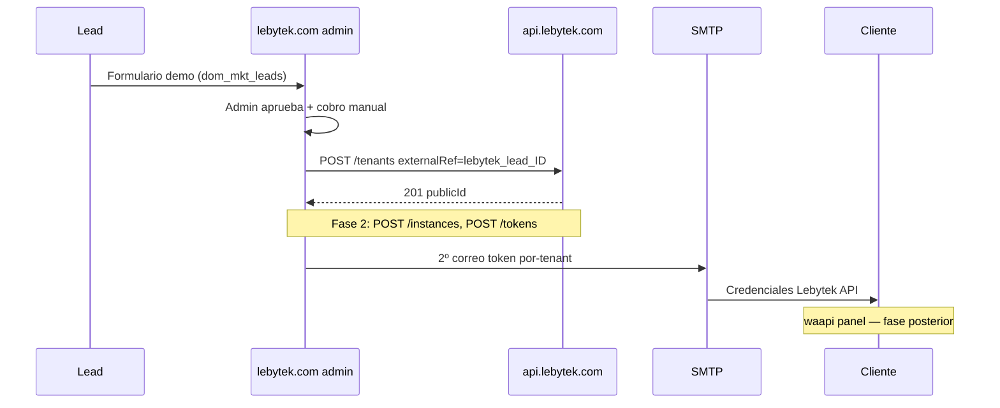

# Spec — Alineación documentación de integración (deuda documental)

**Fecha:** 2026-06-30  
**Repo:** `WhatsApiLebytek` (fuente de verdad del contrato)  
**Estado:** Propuesto — pendiente de aprobación  
**Alcance:** Solo ítem **1. Deuda documental** de la checklist de onboarding. Sin código api ni back-office en este spec.

---

## 1. Problema

Los cinco archivos en `docs/integration/` mezclan **dos modelos incompatibles**:

| Modelo viejo (obsoleto) | Modelo acordado (actual) |
|-------------------------|---------------------------|
| waapi.orquesta provisioning | **lebytek.com** (back-office) orquesta |
| Tabla `organizations`, `waapi_org_{id}` | Tabla **`dom_mkt_leads`**, `lebytek_lead_{id}` |
| Guía Laravel / artisan / Eloquent | Guía **Lebytek Framework** (PHP, `config/container.php`) |
| lebytek.com sin integración api | lebytek.com **consume** api con token plataforma |
| 2º correo = token + login waapi obligatorio | 2º correo = **token Lebytek por correo**; waapi opcional / fase posterior |

Implementar código sin corregir docs provoca consumidor, tablas y flujo equivocados.

---

## 2. Objetivo

Una **fuente de verdad documental** coherente para que el equipo (y Cursor) implemente Fase 1→2 sin ambigüedad:

1. Quién llama a api y con qué token.
2. Qué tablas/columnas usa el back-office.
3. Qué convenciones de nombres son canónicas.
4. Qué está implementado vs planificado en api.
5. Cómo se despliega cada dominio en VPS vs hosting FTP.

**No objetivo:** implementar endpoints, cliente HTTP, deploy ni cutover DNS (ítems 2–4 de la checklist).

---

## 3. Enfoques considerados

### A — Parches mínimos sobre archivos actuales

Editar in-place dejando nombres `waapi-*` y añadir notas “deprecated”.

- **Pro:** diff pequeño.
- **Contra:** lectores siguen confundidos; dos vocablos en paralelo.

### B — Reescritura + renombre de archivos (recomendado)

Renombrar y reescribir para reflejar consumidor real; dejar redirects/notas en nombres viejos una sola release.

- **Pro:** una sola verdad; menos deuda recurrente.
- **Contra:** hay que actualizar referencias cruzadas (`ARCHITECTURE.md`, `CLAUDE.md`, copia en `Lebytek_Framework`).

### C — Un solo mega-documento

Fusionar todo en `waapi-api-contract.md`.

- **Pro:** un archivo.
- **Contra:** mezcla contrato HTTP, delegación roles y guía operativa Framework; difícil de mantener.

**Decisión:** **Enfoque B.**

---

## 4. Vocabulario canónico (aplicar en todos los docs)

| Concepto | Nombre canónico | Legacy (solo mencionar como alias) |
|----------|-----------------|-------------------------------------|
| Consumidor provisioning | **Back-office lebytek.com** | “waapi” como orquestador |
| Repo back-office | `Parzival2103/Lebytek_Framework` branch `feature/backoffice-api-integration` | repo `Lebytek` abandonado |
| Token HTTP plataforma | `LEBYTEK_API_TOKEN` | — |
| URL api | `LEBYTEK_API_URL=https://api.lebytek.com/api/v1` | — |
| Idempotencia negocio | `externalRef: lebytek_lead_{leadId}` | `waapi_org_{id}` |
| Columna local tenant ULID | `api_tenant_public_id` CHAR(26) en **`dom_mkt_leads`** | `organizations.*` |
| Error último intento | `api_provision_error` TEXT nullable | — |
| Timestamp éxito | `api_provisioned_at` TIMESTAMP nullable | — |
| Ref estable local | `external_ref` VARCHAR(255) UNIQUE | mismo valor que se envía a api |
| Usuario servicio api (.env) | **`WAAPI_SERVICE_EMAIL`** (código actual) | alias documentado `PLATFORM_SERVICE_EMAIL` (objetivo futuro) |
| Comando token | `php artisan integration:issue-waapi-token [--revoke]` | nombre comando se mantiene |
| Panel cliente | **waapi.lebytek.com** — lectura, **fase posterior** | no orquestador |
| Credenciales al cliente | **Correo (2º correo)** con token Sanctum por-tenant | enlace waapi opcional |

### Regla de oro (repetir en delegación)

> **Un dato, un dueño.** WhatsApp técnico vive en **api**. El back-office **orquesta** y **comunica** al cliente por correo. waapi solo lee (más adelante).

---

## 5. Mapa de dominios (para `ARCHITECTURE.md`)

```
lebytek.com (VPS futuro)          api.lebytek.com              waapi.lebytek.com
back-office + landing pública   motor Laravel                panel cliente (fase final)
Framework + skeleton v1.0       WhatsApiLebytek              congelado por ahora
FTP México = legacy pre-1.0     auto-pull main               token en .env (lectura)
        │                              ▲
        │  Bearer plataforma           │
        └──────── POST /tenants ───────┘
                    POST /instances (Fase 2)
                    POST /tenants/{id}/tokens

docs.lebytek.com — sin tocar (placeholder)
Green API ──webhooks──► api únicamente
```

**Deploy hoy:**

| Dominio | Dónde vive ahora | Target |
|---------|------------------|--------|
| lebytek.com | Hosting México FTP (monolito pre-1.0) | `/home/lebytek/htdocs/lebytek.com` en VPS (branch feature) |
| api.lebytek.com | VPS, `main` | sin cambio |
| waapi.lebytek.com | VPS, congelado | sin cambio |
| docs.lebytek.com | placeholder | sin cambio |

---

## 6. Cambios por archivo

### 6.1 `waapi-api-contract.md` (mantener nombre — contrato HTTP estable)

**Rol:** contrato técnico api ↔ consumidores. El nombre “waapi” en el filename es legacy aceptable si el contenido es correcto.

**Ediciones obligatorias:**

1. Sustituir ejemplos `waapi_org_*` → `lebytek_lead_*`.
2. Sustituir “waapi debe persistir en organizations” → “back-office persiste en `dom_mkt_leads`”.
3. Sección bootstrap: token → `.env` de **lebytek.com** (y nota: waapi tiene copia legacy para fase panel).
4. Marcar `POST /tenants/{publicId}/tokens` como **Fase 1 contrato / implementación pendiente** (no fingir que existe en `routes/api.php`).
5. Añadir subsección **Entrega al cliente (2º correo)**:
   - Obligatorio: token por-tenant Sanctum (texto plano, una sola emisión).
   - Opcional en v1 operativa: URL waapi, QR, instrucciones API directa.
   - Prohibido: token Green API crudo.
6. Documentar env api: **`WAAPI_SERVICE_EMAIL`** como valor real + nota “renombrar a `PLATFORM_SERVICE_*` en código (P2)”.

### 6.2 `role-delegation-waapi.md` → **`role-delegation-lebytek-api.md`**

**Rol:** reparto de responsabilidades api ↔ back-office.

**Reescritura completa:**

| Capa | lebytek.com (Framework) | api (Laravel) |
|------|-------------------------|---------------|
| Landing / captación leads | Sí (`dom_mkt_leads`, marketing) | No |
| Aprobar lead + cobro manual | Sí (admin CRUD) | No |
| `POST /tenants`, Fase 2 instances/tokens | Orquesta | Ejecuta |
| Mapeo lead ↔ tenant | columnas en `dom_mkt_leads` | `core_tenants.external_ref` |
| Green API | **Nunca** | Sí |
| Webhooks Green | **Nunca** | Sí |
| Token plataforma | `.env` `LEBYTEK_API_TOKEN` | emite artisan |
| 2º correo al cliente | Sí (SMTP) | No |
| Panel waapi | No (fase final) | No |

**Migración SQL canónica** (en doc, no ejecutar aquí):

```sql
ALTER TABLE dom_mkt_leads
  ADD COLUMN api_tenant_public_id CHAR(26) NULL,
  ADD COLUMN external_ref VARCHAR(255) NULL,
  ADD COLUMN api_provisioned_at TIMESTAMP NULL,
  ADD COLUMN api_provision_error TEXT NULL,
  ADD UNIQUE KEY dom_mkt_leads_api_tenant_public_id_unique (api_tenant_public_id),
  ADD UNIQUE KEY dom_mkt_leads_external_ref_unique (external_ref);
```

Convención: `external_ref = CONCAT('lebytek_lead_', id)`.

**Diagrama mermaid:** Lead → lebytek.com admin → api (no pasar por waapi).

**Archivo viejo:** al inicio de `role-delegation-waapi.md`, una sola caja de aviso + enlace al nuevo archivo; eliminar contenido obsoleto en commit de implementación del spec.

### 6.3 `waapi-implementation-real.md` → **`lebytek-implementation-real.md`**

**Rol:** guía operativa para **`Lebytek_Framework`** (no waapi).

**Reescritura completa — estructura:**

1. Variables `.env` (`LEBYTEK_API_*`).
2. Cliente `App\Infrastructure\Integrations\LebytekApi\LebytekApiClient` (curl, sin Laravel).
3. Binding en `config/container.php`.
4. Servicio `LeadApiProvisioningService` (nombre sugerido) invocado al **aprobar lead** (acción CRUD / handler), no post-registro org.
5. Plantilla **2º correo** (token + instrucciones mínimas API; waapi TBD).
6. Desactivar camino legacy: `GREEN_API_*` + `DemoProvisioningService` → documentar toggle `integrations` demo local **off** cuando api esté wired.
7. Comandos Framework: `php scripts/...` o cron PHP, **no** `php artisan`.
8. Checklist implementación back-office (sustituye checklist waapi).
9. Prohibiciones: green-api.com en `app/`, webhooks Green, tokens Green en BD.

Eliminar: `Organization`, Eloquent, `Illuminate\Support\Str`, `organizations:reconcile-api`.

### 6.4 `VPS_CHECKLIST.md`

**Añadir sección `lebytek.com` (VPS target):**

- Ruta `/home/lebytek/htdocs/lebytek.com`
- Usuario CloudPanel `lebytek`
- Branch `feature/backoffice-api-integration`
- `composer install`, docroot `public/`
- `.env`: DB, mail, `LEBYTEK_API_*`
- Instalador / migrate / seed
- Smoke: landing + admin login

**Actualizar sección api:**

- `WAAPI_SERVICE_EMAIL` (nota alias PLATFORM)
- Token copiado a **lebytek.com** `.env` (primario) y waapi (legacy)

**Actualizar sección waapi:**

- Encabezado “congelado — panel fase final”
- Checklist integración marcado como **diferido**

**Actualizar sección marketing:**

- Quitar “sin lógica api”
- CTA puede seguir apuntando a landing propia; DNS cutover cuando E2E verde

### 6.5 `prompt2-review-pre-waapi.md`

**No reescribir.** Añadir banner al inicio:

> Documento histórico (auditoría núcleo api pre-pivot). Consumidor actual: **lebytek.com**, no waapi. Ver `role-delegation-lebytek-api.md`.

### 6.6 `docs/ARCHITECTURE.md`

Alinear diagrama y tabla de dominios con sección 5 de este spec. Actualizar enlaces a archivos renombrados.

### 6.7 `docs/integration/README.md` (en ambos repos)

Índice de integración con una línea por archivo y rol.

---

## 7. Sincronización entre repos

| Repo | Acción |
|------|--------|
| `WhatsApiLebytek` | Fuente de verdad — aplicar todos los cambios |
| `Lebytek_Framework` | Copiar/espejar `docs/integration/*` + enlace a spec api |
| `docs.lebytek.com` | Sin cambios |

Orden: commit docs en **WhatsApiLebytek** primero; copiar a Framework en el mismo PR o commit inmediato posterior.

---

## 8. Flujo documentado (referencia para implementación futura)



---

## 9. Criterios de aceptación (spec docs)

- [ ] Ningún doc dice que lebytek.com “no se integra con api”.
- [ ] Ningún doc usa `organizations` / `waapi_org_{id}` como camino principal.
- [ ] `waapi-implementation-real.md` reemplazado o redirigido; guía Framework sin Laravel.
- [ ] `ARCHITECTURE.md` y `VPS_CHECKLIST.md` reflejan VPS lebytek + FTP legacy + waapi congelado.
- [ ] Contrato distingue **implementado** vs **pendiente** para `POST /tenants/{id}/tokens`.
- [ ] 2º correo documentado: token obligatorio; waapi opcional.
- [ ] `WAAPI_SERVICE_*` documentado como env real + alias PLATFORM futuro.
- [ ] Copia alineada en `Lebytek_Framework/docs/integration/`.
- [ ] `CLAUDE.md` (api) enlaces actualizados.

---

## 10. Plan de implementación sugerido (solo docs, 1 PR)

| Orden | Tarea | Archivos |
|-------|-------|----------|
| 1 | Vocabulario + ARCHITECTURE | `ARCHITECTURE.md`, `CLAUDE.md` |
| 2 | Contrato HTTP | `waapi-api-contract.md` |
| 3 | Delegación roles | nuevo `role-delegation-lebytek-api.md`, stub viejo |
| 4 | Guía operativa | nuevo `lebytek-implementation-real.md`, stub viejo |
| 5 | VPS + README índice | `VPS_CHECKLIST.md`, `docs/integration/README.md` |
| 6 | Banner histórico | `prompt2-review-pre-waapi.md` |
| 7 | Espejo Framework | copiar carpeta integration |

**Estimación:** 1 PR documental, sin tests de código.

---

## 11. Fuera de alcance (specs siguientes)

- Ítem 2: `POST /tenants/{id}/tokens`, Fase 2 instancias (spec aparte ya existe: `2026-06-29-green-api-partner-instances-design.md`).
- Ítem 3: `LebytekApiClient`, migración leads, deploy VPS.
- Ítem 4: E2E, DNS cutover.
- Ítem 5: waapi panel, docs.lebytek.com.

---

## 12. Aprobación

Tras revisar este spec:

1. Confirmar enfoque B (renombre + reescritura).
2. Confirmar convención `lebytek_lead_{id}`.
3. Confirmar 2º correo sin waapi en v1 operativa.

Siguiente paso post-aprobación: plan de tareas con **writing-plans** (`docs/superpowers/plans/2026-06-30-integration-docs-alignment.md`).
