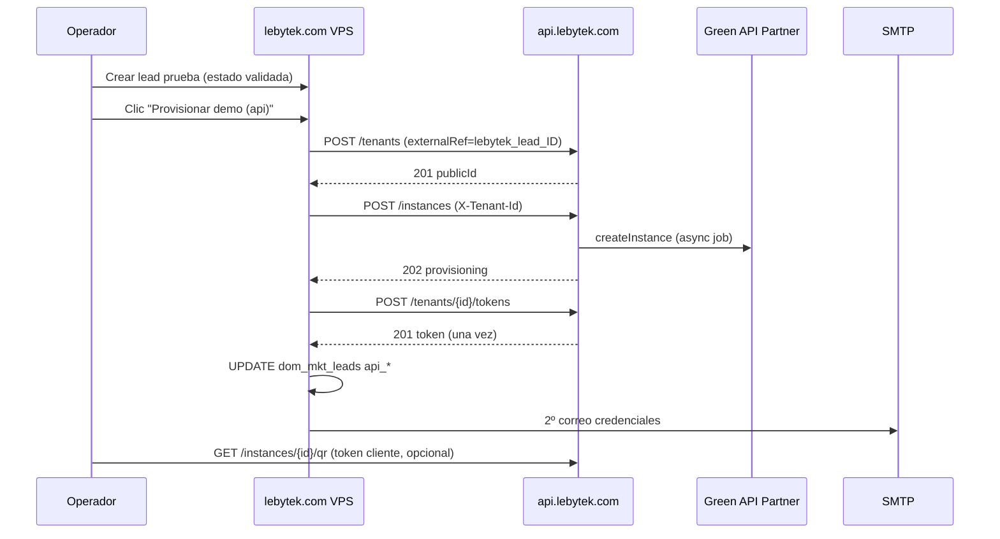

# Spec — Integración E2E Fase 0 + Fase 1 (operativa + back-office)

**Fecha:** 2026-07-01  
**Repo fuente de verdad:** `WhatsApiLebytek` (contrato + spec)  
**Repos afectados:** `WhatsApiLebytek` (docs/env), `Lebytek_Framework` (código back-office), VPS (`lebytek-vps`)  
**Estado:** Propuesto — pendiente de aprobación  
**Precede a:** Fase 2 vertical WhatsApp (campañas/mensajes), panel waapi, DNS cutover

**Contexto previo:**
- [2026-06-30-integration-docs-alignment-design.md](2026-06-30-integration-docs-alignment-design.md) — docs alineados
- [../integration/lebytek-implementation-real.md](../integration/lebytek-implementation-real.md) — guía operativa
- [../integration/VPS_CHECKLIST.md](../integration/VPS_CHECKLIST.md) — smoke tests

---

## 1. Problema

La integración **lebytek.com ↔ api.lebytek.com** tiene código en ambos repos (cliente HTTP, provisioning, endpoints Fase 2 parcial), pero **no está verificada end-to-end en producción**. Riesgos concretos detectados en auditoría 2026-07-01:

| Hallazgo | Impacto |
|----------|---------|
| `.env` lebytek.com en VPS ≈ 423 bytes (vs ~1.8 KB en api) | Probable falta de `MAIL_*` → 2º correo falla silenciosamente |
| VPS lebytek en `461ecd0`; local Framework en `c2d51cd` | Deploy desactualizado (health script, helpers) |
| Sin cron `lebytek-api-health.php` | Sin alerta si api cae |
| E2E provisioning no ejecutado en VPS | No se sabe si partner token + instancia + correo funcionan juntos |
| CRUD leads sin columnas `api_*` | Operador no ve estado de provisioning |
| Camino legacy Green (`DemoProvisioningService`) activo en Framework | Confusión operativa; dos flujos paralelos |
| Docs marcan `POST /tokens` como pendiente | Desalineación doc ↔ código (ya implementado en api `c9b1bc2`) |

**Objetivo de este spec:** cerrar **Fase 0** (E2E operativo en VPS) y **Fase 1** (back-office usable por operador) antes de continuar con vertical WhatsApp o cutover DNS.

---

## 2. Alcance

### Incluido

| Fase | Nombre | Entregables |
|------|--------|-------------|
| **0** | Desbloqueo E2E operativo | Env VPS completo, deploy latest, smoke E2E documentado y verde, cron health |
| **1** | Cierre back-office | Columnas CRUD, flujo operativo claro, tests integración, legacy Green off, plantilla correo |

### Fuera de alcance (specs posteriores)

- Endpoints `/campaigns`, `/messages`, `/credentials/green-api` (Fase 2 api)
- Panel waapi.lebytek.com
- DNS cutover lebytek.com (FTP México → VPS)
- Merge `feature/backoffice-api-integration` → `main`
- Sync masivo docs.lebytek.com (solo nota de actualización mínima en contrato si bloquea operación)
- Observabilidad P2 (Sentry, 2FA)
- Renombrado `WAAPI_SERVICE_*` → `PLATFORM_SERVICE_*`

---

## 3. Enfoques considerados

### A — Solo ops manual (sin cambios de código)

Completar `.env`, deploy, smoke curl manual, cron. Dejar CRUD y tests para después.

- **Pro:** más rápido; valida hipótesis de infra
- **Contra:** operador sigue ciego; regresiones sin tests; legacy Green confunde

### B — Ops + back-office mínimo (recomendado)

Fase 0 ops + Fase 1 con columnas CRUD, desactivar legacy Green en admin, tests cliente HTTP, plantilla correo dedicada. Provisioning sigue siendo **acción manual** por fila (botón CRUD existente).

- **Pro:** E2E verificable + operable; YAGNI (no hook automático aún)
- **Contra:** operador debe recordar flujo validada → provisionar

### C — Ops + hook automático al cambiar estado

Igual que B pero `hooks.handler` en CRUD dispara provisioning al pasar a `validada`.

- **Pro:** menos clics
- **Contra:** riesgo de provisionar sin cobro manual; requiere idempotencia + permisos + rollback; scope mayor

**Decisión:** **Enfoque B.** El cobro manual es requisito de negocio; el botón "Provisionar demo (api)" ya existe y es explícito. Hook automático queda como mejora futura (Fase 1.5 opcional).

---

## 4. Diseño — Fase 0: Desbloqueo E2E operativo

### 4.1 Variables de entorno (VPS)

#### api.lebytek.com (`/home/lebytek-api/htdocs/api.lebytek.com`)

| Variable | Obligatoria | Verificación |
|----------|-------------|--------------|
| `GREEN_API_PARTNER_TOKEN` | Sí (instancias) | Valor no vacío; Partner API responde en job |
| `WEBHOOK_SECRET` | Sí | Generado, coincide con `setSettings` en provisioning |
| `WAAPI_SERVICE_EMAIL` | Sí | Usuario platform admin existe |
| `REDIS_*`, `QUEUE_CONNECTION=redis` | Sí | Horizon procesa jobs |
| `APP_URL=https://api.lebytek.com` | Sí | Webhook URL correcta |

Token plataforma para back-office:

```bash
cd /home/lebytek-api/htdocs/api.lebytek.com
sudo -u lebytek-api php artisan integration:issue-waapi-token --revoke
# Copiar salida → LEBYTEK_API_TOKEN en lebytek.com
```

#### lebytek.com (`/home/lebytek/htdocs/lebytek.com`)

| Variable | Obligatoria | Verificación |
|----------|-------------|--------------|
| `LEBYTEK_API_URL` | Sí | `https://api.lebytek.com/api/v1` |
| `LEBYTEK_API_TOKEN` | Sí | Longitud > 20; health script OK |
| `MAIL_DRIVER` | Sí | `smtp` en prod (no `log`) |
| `MAIL_HOST`, `MAIL_PORT`, `MAIL_USERNAME`, `MAIL_PASSWORD` | Sí | Envío real |
| `MAIL_FROM_ADDRESS`, `MAIL_FROM_NAME` | Sí | Remitente válido |
| `DB_*` | Sí | `dom_mkt_leads` con columnas api |
| `APP_URL` | Sí | URL accesible admin |

Plantilla mínima esperada en `.env` lebytek (referencia `.env.example` Framework):

```env
LEBYTEK_API_URL=https://api.lebytek.com/api/v1
LEBYTEK_API_TOKEN=<desde artisan api>
MAIL_DRIVER=smtp
MAIL_HOST=...
MAIL_PORT=465
MAIL_ENCRYPTION=ssl
MAIL_USERNAME=...
MAIL_PASSWORD=...
MAIL_FROM_ADDRESS=noreply@lebytek.com
MAIL_FROM_NAME="Lebytek"
GREEN_API_ENABLED=false
```

### 4.2 Deploy lebytek.com latest

Ejecutar en VPS (script existente o equivalente):

```bash
# Desde repo local o copiar scripts/vps-deploy-lebytek-com.sh al VPS
bash /path/to/vps-deploy-lebytek-com.sh
```

**Criterio:** commit VPS ≥ `c2d51cd` (health bootstrap fix + deploy helpers).

Post-deploy:

1. `composer install --no-dev`
2. `php scripts/migrate.php` (columnas api en `dom_mkt_leads`)
3. `php scripts/lebytek-api-health.php` → `[OK]`
4. Smoke HTTP: `/`, `/admin/login` con Host `lebytek.com`

### 4.3 Procedimiento smoke E2E

Secuencia canónica (manual, documentar resultado en checklist):



**Verificaciones post-smoke:**

| # | Check | Cómo |
|---|-------|------|
| 1 | Tenant en api | `GET /tenants/{publicId}` con token plataforma |
| 2 | Instancia en api | `GET /instances` con `X-Tenant-Id` |
| 3 | Lead actualizado | `api_tenant_public_id` NOT NULL, `estado=demo_enviada` |
| 4 | Correo recibido | Bandeja lead prueba contiene token + base URL |
| 5 | Sin token Green en correo | Inspección manual |
| 6 | Idempotencia | Re-clic provisionar → no duplica tenant |

**Lead de prueba sugerido:** email controlado del operador; slug único; eliminar tras verificación.

### 4.4 Cron health monitoring

Crontab usuario `lebytek`:

```cron
*/5 * * * * cd /home/lebytek/htdocs/lebytek.com && php scripts/lebytek-api-health.php >> storage/logs/api-health.log 2>&1
```

El script ya existe; debe loguear fallos **sin** imprimir token. Rotación de log vía logrotate opcional (P2).

### 4.5 Criterios de aceptación Fase 0

- [ ] `GREEN_API_PARTNER_TOKEN` configurado y no vacío en api VPS
- [ ] `LEBYTEK_API_TOKEN` + `MAIL_*` smtp configurados en lebytek VPS
- [ ] Deploy lebytek ≥ `c2d51cd`
- [ ] `php scripts/lebytek-api-health.php` → exit 0
- [ ] Smoke E2E completo verde (tabla §4.3)
- [ ] Cron health instalado y primera línea en log tras 5 min
- [ ] `VPS_CHECKLIST.md` actualizado con resultados (fechas/checks marcados)

---

## 5. Diseño — Fase 1: Cierre back-office

### 5.1 Columnas api en CRUD leads

**Archivo:** `Lebytek_Framework/config/cruds/mkt_leads.json`

Añadir a `list.columns`:

| Columna | Label | Notas |
|---------|-------|-------|
| `api_tenant_public_id` | Tenant API | truncar visual si > 26 chars |
| `api_provisioned_at` | Provisionado | format datetime |
| `api_provision_error` | Error API | badge danger si NOT NULL |

Añadir a `detail.tabs[general].columns`: mismas + `external_ref`.

**No** editables en formulario (solo lectura vía show/detail).

### 5.2 Flujo operativo documentado

Procedimiento para operador (añadir a `lebytek-implementation-real.md` § operaciones):

1. Lead entra → `pendiente`
2. Admin revisa → cambia a `validada` (cobro manual registrado fuera del sistema o en notas)
3. Admin clic **"Provisionar demo (api)"** en fila del lead
4. Sistema orquesta tenant + instancia + token + correo
5. Lead pasa a `demo_enviada` automáticamente (`PdoLeadRepository::markApiProvisioned`)
6. Si falla → `api_provision_error` visible en listado; operador corrige env y reintenta

**Regla:** no provisionar si `api_tenant_public_id` ya existe (idempotente — ya implementado).

### 5.3 Desactivar camino legacy Green

| Acción | Detalle |
|--------|---------|
| `.env` prod | `GREEN_API_ENABLED=false` (ya default en `.env.example`) |
| Admin UI | Ocultar o marcar "deprecated" sección auto-provisión Green en `IntegrationsController` cuando `GREEN_API_ENABLED=false` |
| Docs | Nota en guía: único camino demo = api.lebytek.com |

**No eliminar** código legacy aún (tests Framework lo usan); solo deshabilitar en producción.

### 5.4 Plantilla 2º correo

**Ubicación:** `Lebytek_Framework/app/Presentation/Views/emails/lead_api_credentials.php` (nuevo)

**Contenido mínimo v1:**

- Saludo con `{{nombre}}`
- Token Sanctum por-tenant (una sola emisión)
- Base URL `https://api.lebytek.com/api/v1`
- Instrucción: conservar correo; token no se repite
- **Prohibido:** token Green, enlace waapi (fase posterior)
- Footer Lebytek

Refactor `LeadApiProvisioningService::sendCredentialsEmail` para usar vista + `MailerInterface` con HTML.

### 5.5 Tests de integración (Framework)

**Ubicación:** `Lebytek_Framework/tests/Integration/`

| Test | Qué valida |
|------|------------|
| `LebytekApiClientTest` | Headers Bearer, Idempotency-Key en POST; retry en 429 simulado |
| `LeadApiProvisioningServiceTest` | Mock HTTP: flujo completo persiste lead + dispara mail; idempotencia si ya provisionado; error persiste `api_provision_error` |

Patrón: mock curl vía inyección o stub HTTP — **sin** llamadas reales a api en CI.

Ejecutar: `php tests/run.php Integration`

### 5.6 Actualización documental mínima (bloqueante operación)

En `docs/integration/waapi-api-contract.md`:

- Marcar `POST /tenants/{publicId}/tokens` e `/instances` como **implementados** (quitar nota "pendiente en código")
- Mantener campañas/mensajes como planned

En checklists de `lebytek-implementation-real.md` y `role-delegation-lebytek-api.md`: marcar ítems completados tras Fase 0/1.

### 5.7 Criterios de aceptación Fase 1

- [ ] CRUD leads muestra columnas api en list + detail
- [ ] Flujo operativo documentado en guía Framework
- [ ] `GREEN_API_ENABLED=false` en prod; UI legacy no usable
- [ ] Plantilla correo HTML dedicada; texto plano fallback
- [ ] ≥ 2 tests integración verdes en Framework
- [ ] Contrato api actualizado (tokens/instances implementados)
- [ ] Checklists integration marcados según estado real

---

## 6. Orden de implementación

| Orden | Tarea | Repo | Depende de |
|-------|-------|------|------------|
| 1 | Completar `.env` api + lebytek en VPS | VPS | — |
| 2 | Emitir/rotar token plataforma → lebytek `.env` | VPS api | 1 |
| 3 | Deploy lebytek latest (`vps-deploy-lebytek-com.sh`) | VPS | 1–2 |
| 4 | Smoke E2E manual + documentar resultado | VPS | 3 |
| 5 | Instalar cron health | VPS | 4 |
| 6 | Columnas CRUD `mkt_leads.json` | Framework | — (paralelo post-4) |
| 7 | Plantilla correo + refactor service | Framework | — |
| 8 | Desactivar legacy Green en prod + UI guard | Framework | 4 |
| 9 | Tests integración | Framework | 6–7 |
| 10 | Actualizar docs contrato + checklists | WhatsApiLebytek | 4–9 |
| 11 | Copiar docs a Framework mirror | Framework | 10 |

**Estimación:** 1–2 días ops + 1 PR Framework + 1 PR docs.

---

## 7. Riesgos y mitigaciones

| Riesgo | Mitigación |
|--------|------------|
| Partner token inválido / sin cuota Green | Verificar en consola Green antes de smoke; log Horizon en fallo job |
| SMTP bloqueado en VPS | Probar `MAIL_DRIVER=log` en staging local; usar relay del hosting |
| Instancia async no lista a tiempo | Smoke tolera polling; documentar espera 30–60 s |
| Re-provision accidental | Idempotencia `externalRef` + check `api_tenant_public_id` (ya en código) |
| Deploy sobrescribe `.env` | Script ya hace backup; verificar post-deploy |

---

## 8. Rollback

**lebytek.com:** restaurar commit anterior + `.env` backup (`/tmp/lebytek-env-backup.env` del script deploy).

**api:** no tocar en Fase 0/1 salvo env; rollback git solo si deploy api rompe endpoints.

**DNS:** no se modifica en este spec.

---

## 9. Aprobación

Confirmar:

1. Enfoque B (manual provision button, no hook automático)
2. Alcance Fase 0 + 1 sin DNS cutover ni vertical mensajes
3. Plantilla correo sin waapi link en v1

**Siguiente paso post-aprobación:** invocar skill **writing-plans** → `docs/superpowers/plans/2026-07-01-integration-e2e-phase0-1.md`

---

## 10. Referencias

| Recurso | Ruta |
|---------|------|
| Guía back-office | `docs/integration/lebytek-implementation-real.md` |
| Contrato HTTP | `docs/integration/waapi-api-contract.md` |
| VPS checklist | `docs/integration/VPS_CHECKLIST.md` |
| Deploy script | `Lebytek_Framework/scripts/vps-deploy-lebytek-com.sh` |
| Health script | `Lebytek_Framework/scripts/lebytek-api-health.php` |
| Provisioning service | `Lebytek_Framework/app/Application/Marketing/LeadApiProvisioningService.php` |
