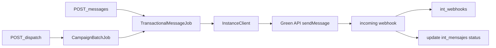
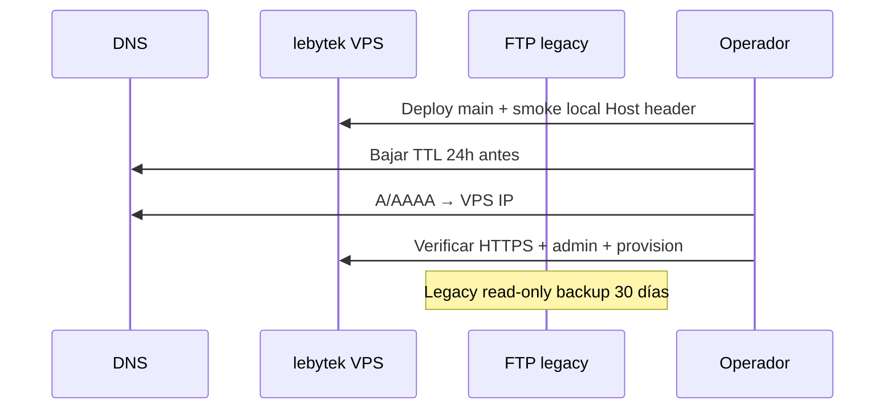

# Spec — Integración Fase 2 + Fase 3 (vertical WhatsApp + go-live)

**Fecha:** 2026-07-01  
**Repo fuente de verdad:** `WhatsApiLebytek`  
**Repos afectados:** `WhatsApiLebytek` (vertical api), `Lebytek_Framework` (consumidor mínimo), `docs.lebytek.com` (hub), VPS  
**Estado:** Propuesto — pendiente de aprobación  
**Precede a:** Panel waapi completo, facturación, observabilidad P2

> **⚠️ Estado remediación (2026-07-02):** El trabajo **Fase 2b** (lifecycle demo: deprovision, expiración, estados CRUD) está **implementado** en Framework. Los entregables **Fase 2a** (vertical `/messages` en api) y **Fase 3** (go-live DNS/docs/main) siguen **pendientes**. Ver [2026-07-02-integration-roadmap-remediation-design.md](2026-07-02-integration-roadmap-remediation-design.md).

**Contexto previo:**
- [2026-07-01-integration-e2e-phase0-1-design.md](2026-07-01-integration-e2e-phase0-1-design.md) — E2E + back-office operativo
- [2026-06-29-green-api-partner-instances-design.md](2026-06-29-green-api-partner-instances-design.md) — instancias Partner (implementado)
- [../integration/waapi-api-contract.md](../integration/waapi-api-contract.md) — contrato HTTP

---

## 0. Revisión — qué entregó Fase 0 + Fase 1 (baseline)

Auditoría post-plan `2026-07-01-integration-e2e-phase0-1.md`:

### Implementado en código

| Entregable | Repo | Evidencia |
|------------|------|-----------|
| Cliente HTTP testeable | Framework | `LebytekApiClient` + `LebytekApiTransport` / `CurlLebytekApiTransport` |
| Provisioning completo | Framework | `LeadApiProvisioningService` — tenant + instance + token + correo |
| Plantilla 2º correo HTML | Framework | `app/Presentation/Views/emails/lead_api_credentials.php` + partials |
| Columnas api en CRUD | Framework | `config/cruds/mkt_leads.json` + `CrudTableBuilder` truncate/badge |
| Legacy Green desactivado | Framework | `IntegrationsController` guard + `GREEN_API_ENABLED=false` |
| Tests integración | Framework | `tests/Integration/LebytekApiClientTest.php`, `LeadApiProvisioningServiceTest.php` |
| Reenvío credenciales | Framework | `scripts/resend-lead-credentials.php` |
| Endpoints instancias + tokens | api | `routes/api.php`, tests `InstanceProvisioningTest`, `TenantTokenTest` |
| Docs alineados | api + Framework | Contrato marca tokens/instances implementados; checklists parcialmente `[x]` |

### Verificado en VPS (2026-07-01)

| Check | Estado |
|-------|--------|
| `GREEN_API_PARTNER_TOKEN` api | OK |
| `LEBYTEK_API_TOKEN` + SMTP lebytek | OK |
| Deploy lebytek ≥ `c2d51cd`, health exit 0 | OK |
| Smoke E2E provisioning (botón CRUD) | OK |
| Cron health cada 5 min | **Pendiente confirmar crontab** |

### Brechas que arrastran a Fase 2/3

- Cliente demo recibe token pero **no puede enviar mensajes** (endpoints `/messages` no existen).
- Webhooks solo procesan `stateInstanceChanged`; **mensajes entrantes** no persisten.
- Jobs `TransactionalMessageJob` / `CampaignBatchJob` son **stubs**.
- Permisos `mensajes.*`, `campanias.*`, `credenciales.*` **no están** en `config/permissions.php`.
- `lebytek.com` sigue en branch feature; **DNS apunta a FTP legacy**.
- `docs.lebytek.com` desactualizado respecto a integration docs.
- Correo incluye CTA a docs (`MKT_EMAIL_DOCS_URL`) pero hub no está en producción.

---

## 1. Problema

Fase 0/1 cerró el **onboarding demo** (lead → tenant → instancia → token → correo). El producto prometido es **API de WhatsApp gestionada** con envío transaccional y campañas. Hoy el cliente puede vincular WhatsApp (QR vía token por-tenant) pero **no puede usar la API para enviar ni consultar mensajes**.

Sin Fase 2, la demo es un dead-end técnico. Sin Fase 3, el back-office moderno no reemplaza al monolito FTP y la documentación pública no acompaña al cliente.

**Objetivo Fase 2:** vertical WhatsApp funcional en **api.lebytek.com** (envío, campañas, webhooks completos).  
**Objetivo Fase 3:** **go-live** del ecosistema integrado (producción estable, DNS, docs, operaciones).

---

## 2. Alcance

### Fase 2 — Vertical WhatsApp (api.lebytek.com)

| # | Entregable |
|---|------------|
| 2.1 | Permisos RBAC: `mensajes.*`, `campanias.*`, `credenciales.gestionar` |
| 2.2 | Tablas: `int_mensajes`, `dom_campanias`, `dom_campania_destinatarios` (o equivalente prefijado), `int_webhooks` |
| 2.3 | `POST /messages`, `GET /messages/{publicId}` |
| 2.4 | `GET /campaigns`, `POST /campaigns`, `POST /campaigns/{publicId}/dispatch` |
| 2.5 | `PUT /credentials/green-api` (tenant-scoped, cifrado) — solo si tenant trae credenciales propias; **no** expone token Green en respuestas |
| 2.6 | `TransactionalMessageJob` real — envío vía `InstanceClient::sendMessage` |
| 2.7 | `CampaignBatchJob` — batch Horizon con chunks + rate limit Redis |
| 2.8 | Webhooks: persistir en `int_webhooks`; procesar mensajes entrantes (`incomingMessageReceived`) |
| 2.9 | Token por-tenant: abilities `mensajes.enviar`, `mensajes.ver` además de `instancias.ver` |
| 2.10 | Tests Pest (Http::fake, Bus::fake) + Scribe regen |
| 2.11 | Contrato OpenAPI actualizado |

### Fase 3 — Go-live producción

| # | Entregable |
|---|------------|
| 3.1 | Merge `feature/backoffice-api-integration` → `main` (Framework) |
| 3.2 | DNS cutover `lebytek.com` → VPS (`/home/lebytek/htdocs/lebytek.com/public`) |
| 3.3 | Deploy docs hub `docs.lebytek.com` + sync script CI/manual |
| 3.4 | Completar checklist VPS restante (Horizon, R2, cron health confirmado) |
| 3.5 | Smoke E2E post-cutover (landing + admin + provision demo + envío mensaje prueba) |
| 3.6 | Framework: ampliar token demo con `mensajes.enviar` al provisionar |
| 3.7 | Correo demo: enlace QR/instrucciones vincular WhatsApp (sin waapi panel) |
| 3.8 | Runbook rollback DNS + deploy |

### Fuera de alcance

- Panel waapi.lebytek.com completo (consumo, facturación, adeudos)
- Facturación / cuotas / expiración demo automática
- Observabilidad P2 (Sentry, 2FA admin)
- Renombrado `WAAPI_SERVICE_*` → `PLATFORM_SERVICE_*`
- Hook automático CRUD al cambiar estado lead
- Eliminación código legacy Green en Framework (solo sigue deshabilitado)

---

## 3. Enfoques considerados

### Fase 2 — Vertical mensajes

#### A — Solo mensajes transaccionales (YAGNI estricto)

Implementar `POST /messages` + job + webhook persistencia. Campañas en spec posterior.

- **Pro:** valor rápido; demo puede enviar 1 mensaje de prueba
- **Contra:** promesa producto incluye campañas; jobs batch ya existen como stub

#### B — Transaccional + campañas MVP (recomendado)

Mensajes unitarios + campaña simple (lista CSV/JSON de destinatarios, dispatch batch). Sin UI admin campañas en api (solo API REST).

- **Pro:** alinea con prompt2 y contrato; reutiliza stubs existentes
- **Contra:** más tablas y tests; 1–2 semanas api

#### C — Vertical completo + UI Inertia admin campañas

Incluye pantallas admin en api.lebytek.com para operador.

- **Pro:** operadores internos pueden gestionar campañas
- **Contra:** scope grande; lebytek.com no debe duplicar; YAGNI

**Decisión Fase 2:** **Enfoque B.**

### Fase 3 — Go-live

#### A — DNS cutover sin docs hub

Solo apuntar lebytek.com al VPS.

- **Pro:** más rápido
- **Contra:** correo demo enlaza a docs inexistentes/incompletos

#### B — Cutover + docs hub mínimo (recomendado)

Sync integration + API reference a docs.lebytek.com antes de cutover; smoke incluye docs accesibles.

- **Pro:** cliente demo tiene documentación coherente
- **Contra:** requiere deploy nginx docs

#### C — Cutover + waapi panel lectura

Incluye panel cliente congelado reactivado.

- **Pro:** UX cliente
- **Contra:** tercer deploy; fuera de urgencia demo B2B API-first

**Decisión Fase 3:** **Enfoque B.** waapi panel queda Fase 4.

---

## 4. Diseño — Fase 2: Vertical WhatsApp

### 4.1 Modelo de datos

Prefijos según convención api (`int_*` integración, `dom_*` negocio vertical).

#### `int_mensajes`

| Columna | Tipo | Notas |
|---------|------|-------|
| `id` | bigint PK | |
| `public_id` | ULID unique | route key |
| `tenant_id` | FK core_tenants | BelongsToTenant |
| `instancia_id` | FK int_instancias nullable | instancia usada |
| `direction` | enum outbound/inbound | |
| `recipient` | string | teléfono E.164 sin + |
| `body` | text | contenido |
| `status` | enum queued/sent/delivered/failed | |
| `green_message_id` | string nullable | idMessage Green |
| `error` | text nullable | último error |
| `payload_hash` | string nullable | idempotencia envío |
| `sent_at`, `created_at`, `updated_at` | timestamps | |

Índices: `(tenant_id, public_id)`, `(tenant_id, payload_hash)` unique, `(tenant_id, status)`.

#### `dom_campanias`

| Columna | Tipo | Notas |
|---------|------|-------|
| `id`, `public_id`, `tenant_id` | | estándar |
| `name` | string | |
| `status` | enum draft/queued/running/completed/failed/cancelled | |
| `message_template` | text | cuerpo con placeholders mínimos |
| `scheduled_at` | timestamp nullable | |
| `dispatched_at`, `completed_at` | timestamps nullable | |
| `total_recipients`, `sent_count`, `failed_count` | int | contadores |

#### `dom_campania_destinatarios`

| Columna | Tipo | Notas |
|---------|------|-------|
| `id` | bigint PK | |
| `campania_id` | FK | |
| `recipient` | string | |
| `status` | enum pending/sent/failed | |
| `mensaje_id` | FK int_mensajes nullable | |
| `error` | text nullable | |

#### `int_webhooks`

| Columna | Tipo | Notas |
|---------|------|-------|
| `id` | bigint PK | |
| `event_id` | string unique | de header `X-Event-Id` |
| `type_webhook` | string | |
| `id_instance` | string nullable | |
| `payload` | json | raw sanitizado |
| `processed_at` | timestamp | |
| `tenant_id` | FK nullable | resuelto post-parse |

### 4.2 Permisos y tokens

Añadir a `config/permissions.php` y seeders:

| Permiso | Platform | Tenant cliente |
|---------|----------|----------------|
| `mensajes.enviar` | sí (con X-Tenant-Id) | sí |
| `mensajes.ver` | sí | sí (solo propios) |
| `campanias.ver` | sí | sí |
| `campanias.crear` | sí | sí |
| `campanias.enviar` | sí | sí |
| `credenciales.gestionar` | sí | no (platform only) |

**Cambio Fase 3 en Framework:** al emitir token demo, incluir:

```php
['instancias.ver', 'mensajes.enviar', 'mensajes.ver']
```

### 4.3 Endpoints (contrato)

#### `POST /messages`

**Permiso:** `mensajes.enviar`  
**Header:** token por-tenant (confinado) o platform + `X-Tenant-Id`  
**Idempotency-Key:** requerido  

**Body:**

```json
{
  "recipient": "5215512345678",
  "body": "Hola desde Lebytek API",
  "instancePublicId": "01JINST..."
}
```

**Flujo:**
1. Validar instancia pertenece al tenant y `status=authorized`.
2. Crear `int_mensajes` status=`queued`.
3. Dispatch `TransactionalMessageJob`.
4. Responder `202` con `MessageResource` (`publicId`, `status=queued`).

**Idempotencia:** mismo `Idempotency-Key` + tenant → devolver mensaje existente `200`.

#### `GET /messages/{publicId}`

**Permiso:** `mensajes.ver`  
Respuesta: estado, timestamps, error si failed. **Sin** token Green.

#### `POST /campaigns`

**Permiso:** `campanias.crear`  
**Body:** `name`, `messageTemplate`, `recipients[]` (max 10_000 v1).

Crea campaña `draft` + filas destinatarios `pending`.

#### `POST /campaigns/{publicId}/dispatch`

**Permiso:** `campanias.enviar`  
Transición `draft` → `queued` → dispatch `CampaignBatchJob` (chunks de 100).  
Respuesta `202`.

#### `GET /campaigns`, `GET /campaigns/{publicId}`

Listado paginado + detalle con contadores.

#### `PUT /credentials/green-api`

**Permiso:** `credenciales.gestionar` — **solo platform**  
**Body:** `instanceId`, `apiTokenInstance` (cifrado en `int_credenciales` existente o por instancia).  

> YAGNI v1: instancias demo usan credenciales creadas por Partner job. Este endpoint es para tenants BYO credentials en fase posterior; puede implementarse como stub 501 con contrato documentado si retrasa MVP.

**Decisión:** implementar **501 Not Implemented** en v1 con schema documentado; credenciales demo vienen solo de Partner provisioning.

### 4.4 Jobs y rate limiting



**TransactionalMessageJob:**
- Cola `transactional`
- Middleware `RateLimitedWithRedis` (ya existe): 30/min por tenant
- `InstanceClient::sendMessage(recipient, body)`
- Actualiza `int_mensajes.status`, `green_message_id`, `sent_at`
- 3 reintentos backoff; failed → `status=failed`, `error` persistido

**CampaignBatchJob:**
- Cola `campaigns`
- Chunk destinatarios `pending` → N × `TransactionalMessageJob`
- Actualiza contadores campaña al completar batch

### 4.5 Webhooks — extensión

En `IncomingWebhookController`:

| typeWebhook | Acción |
|-------------|--------|
| `stateInstanceChanged` | ya implementado |
| `incomingMessageReceived` | persistir `int_mensajes` inbound + `int_webhooks` |
| `outgoingMessageStatus` | actualizar delivery status outbound |
| otros | persistir en `int_webhooks` only (log) |

Siempre insertar en `int_webhooks` **antes** de procesar (audit + dedup via `X-Event-Id`).

### 4.6 Tests mínimos (Pest)

| Test | Caso |
|------|------|
| `MessageSendTest` | POST 202, job dispatched, idempotency |
| `MessageSendTest` | tenant token confinado; cross-tenant 404 |
| `MessageSendTest` | instancia not authorized → 409 |
| `CampaignDispatchTest` | dispatch crea jobs por chunk |
| `WebhookIncomingMessageTest` | payload fake → int_mensajes inbound |
| `TransactionalMessageJobTest` | Http::fake Green → status sent |

### 4.7 Criterios de aceptación Fase 2

- [ ] Cliente con token demo puede `POST /messages` y recibir WhatsApp en móvil de prueba
- [ ] `GET /messages/{id}` refleja progreso sent/failed
- [ ] Campaña 3 destinatarios → 3 mensajes encolados → contadores correctos
- [ ] Webhook entrante persiste en `int_webhooks` y crea mensaje inbound
- [ ] Scribe `/docs` lista endpoints nuevos
- [ ] Contrato `waapi-api-contract.md` mueve endpoints de "planned" a "implementados"
- [ ] 0 tokens Green en respuestas JSON

---

## 5. Diseño — Fase 3: Go-live producción

### 5.1 Merge y release Framework

1. PR `feature/backoffice-api-integration` → `main`
2. Tag semver `v1.0.0-beta.1` (o acordado)
3. Actualizar `composer.json` referencia si aplica consumidores externos

**Pre-merge checklist:**
- [ ] `php tests/run.php` verde (incl. Integration)
- [ ] Sin secretos en diff
- [ ] `.env.example` documentado

### 5.2 DNS cutover lebytek.com

**Pre-requisitos (bloqueantes):**
- Fase 2 smoke mensaje OK
- Fase 0 cron health confirmado
- Certificado SSL VPS válido para `lebytek.com`
- Backup monolito FTP México

**Secuencia:**



**Rollback:** revertir A record a IP México; restaurar `.env` backup VPS.

### 5.3 docs.lebytek.com

1. Ejecutar `node scripts/sync-docs.mjs` desde repo docs
2. Deploy nginx (`nginx-docs.lebytek.com.conf`) en VPS o hosting
3. Verificar URLs referenciadas en correo demo:
   - `https://docs.lebytek.com/api/content/integration/waapi-api-contract.md`
4. Añadir a sync: `integration/README.md`, stubs si aplica

**Mínimo v1:** sección API integration + guía back-office espejada.

### 5.4 Ampliaciones Framework (post-Fase 2 api)

| Cambio | Archivo |
|--------|---------|
| Token demo con `mensajes.enviar` | `LeadApiProvisioningService::issueTenantToken` abilities |
| Correo: paso "Vincular WhatsApp" | `lead_api_credentials.php` — instrucción GET `/instances/{id}/qr` |
| Script smoke mensaje | `scripts/smoke-send-test-message.php` (curl cliente) |

### 5.5 Smoke E2E post-cutover

| # | Paso | Esperado |
|---|------|----------|
| 1 | `https://lebytek.com/` | 200 landing |
| 2 | Admin login | 200 |
| 3 | Crear lead + provisionar demo | demo_enviada + correo |
| 4 | Escanear QR / autorizar instancia | `GET /instances/{id}` → authorized |
| 5 | `POST /messages` con token del correo | WhatsApp recibido |
| 6 | `https://docs.lebytek.com` | contrato accesible |

### 5.6 Operaciones VPS pendientes

Completar ítems abiertos en `VPS_CHECKLIST.md`:

- Cron health confirmado (`crontab -u lebytek -l`)
- Horizon RUNNING api
- R2 uploads configurado api (si aplica uploads futuros)
- waapi.lebytek.com — **sin cambios** (sigue congelado)

### 5.7 Criterios de aceptación Fase 3

- [ ] `lebytek.com` resuelve a VPS; admin operativo en producción
- [ ] Demo completa: lead → provision → QR → mensaje WhatsApp
- [ ] docs.lebytek.com live con contrato API
- [ ] Framework en `main` desplegado en VPS
- [ ] Runbook rollback documentado en `VPS_CHECKLIST.md`
- [ ] Monolito FTP legacy en modo solo backup (no DNS)

---

## 6. Orden de implementación

| Orden | Fase | Tarea | Repo |
|-------|------|-------|------|
| 1 | 2 | Migraciones tablas mensajes/campañas/webhooks | api |
| 2 | 2 | Permisos + seeders | api |
| 3 | 2 | MessageController + MessageService + Job real | api |
| 4 | 2 | CampaignController + CampaignBatchJob | api |
| 5 | 2 | Webhook extensión + int_webhooks | api |
| 6 | 2 | Tests + Scribe | api |
| 7 | 2 | Actualizar contrato HTTP | api |
| 8 | 3 | Confirmar cron health VPS | ops |
| 9 | 3 | Token demo + correo QR instructions | Framework |
| 10 | 3 | Sync + deploy docs.lebytek.com | docs |
| 11 | 3 | Merge Framework → main | Framework |
| 12 | 3 | DNS cutover + smoke post-cutover | ops |
| 13 | 3 | Actualizar VPS_CHECKLIST + mirror docs | api + Framework |

**Dependencias:** 8 puede paralelizarse con 1–7. 11–12 requieren 1–7 verdes.

**Estimación:** Fase 2 ≈ 1–2 semanas api; Fase 3 ≈ 2–3 días ops + 1 PR Framework.

---

## 7. Riesgos

| Riesgo | Mitigación |
|--------|------------|
| Rate limit Green en campañas | Redis throttle existente; chunk size 100 |
| DNS propagación lenta | TTL bajo 24h antes; verificar desde múltiples resolvers |
| Cliente demo envía spam | v1 sin cuotas; documentar uso responsable; log bitácora |
| `PUT /credentials` scope creep | 501 v1; Partner path único para demo |
| Regresión provisioning post-merge | Smoke E2E antes y después cutover |

---

## 8. Aprobación

Confirmar:

1. Fase 2 Enfoque B (transaccional + campañas MVP, sin UI admin api)
2. Fase 3 Enfoque B (cutover + docs hub; waapi panel diferido)
3. `PUT /credentials/green-api` → 501 en v1 aceptable

**Siguiente paso post-aprobación:** skill **writing-plans** → `docs/superpowers/plans/2026-07-01-integration-phase2-3.md`

---

## 9. Referencias

| Recurso | Ruta |
|---------|------|
| Contrato endpoints planned | `docs/integration/waapi-api-contract.md` § Fase 2 |
| Instancias (implementado) | `docs/superpowers/specs/2026-06-29-green-api-partner-instances-design.md` |
| Jobs stub | `app/Jobs/TransactionalMessageJob.php`, `CampaignBatchJob.php` |
| Webhook | `app/Http/Controllers/Api/V1/IncomingWebhookController.php` |
| E2E Fase 0/1 | `docs/superpowers/specs/2026-07-01-integration-e2e-phase0-1-design.md` |
| Docs sync | `docs.lebytek.com/scripts/sync-docs.mjs` |
