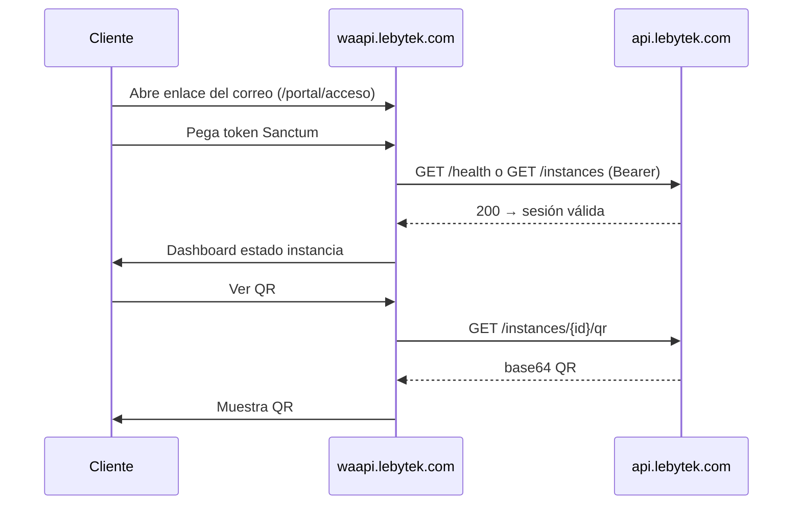

# Spec — Integración Fase 4 + Fase 5 (panel cliente + madurez plataforma)

**Fecha:** 2026-07-02  
**Repo fuente de verdad:** `WhatsApiLebytek`  
**Repos afectados:** `WhatsApiLebytek`, `Lebytek_Framework`, `docs.lebytek.com`, VPS (`waapi.lebytek.com`)  
**Estado:** Propuesto — pendiente de aprobación  
**Cierra el roadmap:** Fases 0→5 de integración lebytek.com ↔ api.lebytek.com

**Contexto previo:**
- [2026-07-01-integration-e2e-phase0-1-design.md](2026-07-01-integration-e2e-phase0-1-design.md)
- [2026-07-01-integration-phase2-3-design.md](2026-07-01-integration-phase2-3-design.md)
- [../integration/waapi-api-contract.md](../integration/waapi-api-contract.md)

---

## 0. Auditoría — estado real tras Fases 0–3

Revisión de código y docs al **2026-07-02**. Usar esta sección como checklist viva antes de iniciar Fase 4.

### Fase 0/1 — E2E + back-office operativo

| Entregable | Estado | Evidencia / nota |
|------------|--------|------------------|
| `LebytekApiClient` + transport testeable | ✅ | `Lebytek_Framework/app/Infrastructure/Integrations/LebytekApi/` |
| Provisioning tenant + instance + token + correo | ✅ | `LeadApiProvisioningService` |
| Plantilla correo branded | ✅ | `emails/lead_api_credentials.php` + partials |
| Columnas `api_*` en CRUD | ✅ | `config/cruds/mkt_leads.json` |
| Legacy Green off en prod | ✅ | `IntegrationsController` guard |
| Tests integración | ✅ | `tests/Integration/*` |
| Smoke E2E VPS provisioning | ✅ | `VPS_CHECKLIST.md` § E2E Fase 0 |
| Cron health 5 min | ⚠️ | Script OK; **crontab VPS sin confirmar** |
| Specs/plans 0/1 en git api | ⚠️ | Archivos untracked en workspace local |

### Fase 2/3 — según spec original vs implementado

El spec [2026-07-01-integration-phase2-3-design.md](2026-07-01-integration-phase2-3-design.md) definía **vertical WhatsApp api** + **go-live DNS/docs**. Lo implementado en repos **no coincide 1:1** con ese spec:

#### Implementado (extensión lifecycle demo — Framework)

| Entregable | Estado | Evidencia |
|------------|--------|-----------|
| Baja demo manual | ✅ | `LeadApiDeprovisioningService`, acción CRUD "Dar de baja demo" |
| Estado `demo_baja` | ✅ | `mkt_leads.json`, `PdoLeadRepository::markApiDeprovisioned` |
| `listInstances` / `deleteInstance` en cliente | ✅ | `LebytekApiClient` |
| Expiración demos 30 días | ✅ | `scripts/expire-api-demos.php` |
| Provision solo si `validada` | ✅ | `visible_when` en CRUD |
| Manejo fallo correo (`mail_failed`) | ✅ | `provisionLead()` retorna status |
| Tests deprovisioning | ✅ | `LeadApiDeprovisioningServiceTest.php` |
| VPS scripts SSL/nginx | ✅ | `vps-restore-lebytek-nginx-ssl.sh`, etc. |

#### Pendiente o no verificado del spec 2/3 original

| Entregable spec 2/3 | Estado | Impacto |
|---------------------|--------|---------|
| `POST/GET /messages` | ❌ | `routes/api.php` sin rutas mensajes |
| `GET/POST /campaigns` + dispatch | ❌ | Jobs siguen stub |
| Tablas `int_mensajes`, `dom_campanias`, `int_webhooks` | ❌ | No hay migraciones |
| Permisos `mensajes.*`, `campanias.*` | ❌ | `config/permissions.php` |
| Token demo con `mensajes.enviar` | ❌ | Sigue `['instancias.ver']` |
| Webhooks mensajes entrantes | ⚠️ | Solo `stateInstanceChanged` |
| DNS cutover `lebytek.com` | ❌ | Checklist: "Do not point DNS" |
| Merge Framework → `main` | ❌ | Branch `feature/backoffice-api-integration` |
| `docs.lebytek.com` en producción | ⚠️ | Repo existe; deploy live no verificado |
| Smoke post-cutover mensaje WhatsApp | ❌ | Requiere `/messages` |

> **Conclusión auditoría:** Fase 2/3 **operativa parcial** — ciclo demo completo (alta/baja/expiración) en back-office, pero **vertical de envío api** y **go-live DNS** del spec original siguen abiertos. Fase 4/5 deben **explicitar** si cierran esos carry-overs o los reordenan.

---

## 1. Problema

Tras Fases 0–3 el ecosistema permite **provisionar y dar de baja demos**, pero:

1. El **cliente final** no tiene panel propio (waapi congelado); solo token + correo.
2. La **API de mensajes/campañas** prometida en contrato sigue en "planned" en varios entornos.
3. **Producción pública** (`lebytek.com` DNS, `main` estable, docs live) no está cerrada.
4. **Deuda P2** (observabilidad, cuotas, 2FA) acumula riesgo operativo post-lanzamiento.

**Objetivo Fase 4:** panel cliente **waapi.lebytek.com** (lectura + QR + onboarding UX) consumiendo **solo api** con token por-tenant.  
**Objetivo Fase 5:** madurez de plataforma — cerrar carry-overs críticos, observabilidad, medición de uso, limpieza legacy, cierre documental.

---

## 2. Alcance

### Fase 4 — Panel cliente waapi (lectura)

| # | Entregable |
|---|------------|
| 4.1 | Reactivar `waapi.lebytek.com` en VPS (sin orquestar provisioning) |
| 4.2 | Login cliente: pegar token Sanctum por-tenant (sesión cifrada; no localStorage plano) |
| 4.3 | Dashboard lectura: estado instancia, `authorized` / `waiting_qr` |
| 4.4 | Vista QR: proxy `GET /instances/{id}/qr` vía api (token cliente) |
| 4.5 | Resumen uso: contadores desde api cuando existan (`TenantUsageService` / mensajes) |
| 4.6 | 2º correo: activar `MKT_EMAIL_DASHBOARD_URL` → enlace waapi |
| 4.7 | Página pública producto WhatsApp (landing mínima waapi, no duplicar lebytek.com) |
| 4.8 | Tests smoke panel + sin llamadas Green directas |

### Fase 5 — Madurez plataforma y cierre integración

| # | Entregable |
|---|------------|
| 5.1 | **Cerrar carry-over spec 2/3:** vertical `/messages` (+ campañas MVP si no existe) |
| 5.2 | DNS cutover `lebytek.com` + merge Framework `main` + deploy tag |
| 5.3 | `docs.lebytek.com` CI sync + deploy nginx |
| 5.4 | Cron VPS: health + `expire-api-demos.php` documentados |
| 5.5 | Observabilidad: Sentry api, alertas Horizon |
| 5.6 | Medición uso: hook `TenantUsageService` en envío mensajes |
| 5.7 | Seguridad prod: deshabilitar `/register` api, `SESSION_SECURE_COOKIE`, revisión tokens |
| 5.8 | `PUT /credentials/green-api` implementado o 501 documentado definitivamente |
| 5.9 | Eliminar código legacy Green no usado en Framework (post-validación) |
| 5.10 | Renombrar `WAAPI_SERVICE_*` → `PLATFORM_SERVICE_*` (alias deprecado una release) |
| 5.11 | Auditoría final + actualizar todos los checklists integration |

### Fuera de alcance (post-roadmap)

- Facturación automática / pasarela de pago
- 2FA admin (Fortify) — puede iniciarse en 5.5 pero no bloqueante
- Panel waapi escritura (enviar campañas desde UI — cliente usa API directa)
- Multi-región / HA

---

## 3. Enfoques considerados

### Fase 4 — Panel waapi

#### A — SPA mínima en waapi (PHP + fetch)

Vistas PHP en skeleton waapi existente; JS fetch a api con token en sesión.

- **Pro:** reutiliza hosting waapi; rápido
- **Contra:** UX limitada

#### B — Panel en Lebytek_Framework ruta `/portal` (recomendado si waapi = mismo repo)

Una app desplegada en `waapi.lebytek.com` desde branch/tag; rutas `/portal/*` con token cliente.

- **Pro:** un solo codebase Framework; comparte mail/branding
- **Contra:** mezcla dominios si no se separa config

#### C — Panel waapi repo/sitio separado (recomendado si waapi ya existe en VPS)

Sitio CloudPanel `waapi.lebytek.com` consume api REST; **cero** Green directo.

- **Pro:** alinea arquitectura "waapi solo lee"
- **Contra:** otro deploy surface

**Decisión:** **Enfoque C** si el vhost waapi ya existe en VPS; **B** si waapi apunta al mismo tree que lebytek feature branch. Verificar en Task 0 auditoría VPS.

### Fase 5 — Orden carry-over vs observabilidad

#### A — Go-live antes que mensajes

DNS cutover con demo actual (sin envío API).

- **Pro:** marketing en VPS ya
- **Contra:** producto incompleto vs contrato

#### B — Mensajes api antes de DNS (recomendado)

Completar `/messages` → smoke mensaje → luego DNS + docs.

- **Pro:** demo vendible end-to-end
- **Contra:** retrasa cutover días/semanas

**Decisión Fase 5:** **Enfoque B** para ítem 5.1 antes de 5.2.

---

## 4. Diseño — Fase 4: Panel waapi

### 4.1 Principios

```
Cliente → waapi.lebytek.com (sesión + UI)
              │ Bearer token por-tenant
              ▼
         api.lebytek.com (única fuente WhatsApp técnico)
              │
              ▼
         Green API (solo api; waapi NUNCA)
```

- waapi **no** llama `lebytek.com` para provisioning.
- waapi **no** guarda tokens Green.
- Token por-tenant solo en sesión server-side (Framework session o Laravel session según stack del sitio waapi).

### 4.2 Flujo login cliente



### 4.3 Pantallas mínimas

| Ruta | Contenido |
|------|-----------|
| `/` | Landing producto WhatsApp API (CTA "Acceder con token") |
| `/portal/acceso` | Formulario token + validación |
| `/portal/dashboard` | Estado instancia, badges, link docs |
| `/portal/qr` | QR + instrucciones escaneo |
| `/portal/uso` | Contadores (mensajes enviados/recibidos) — placeholder OK si api aún no expone |

### 4.4 Integración correo lebytek.com

En `LeadApiProvisioningService` / plantilla:

```env
MKT_EMAIL_DASHBOARD_URL=https://waapi.lebytek.com/portal/acceso
```

Activar botón dashboard en `lead_api_credentials.php` cuando URL definida (campo reservado ya existe en `.env.example`).

### 4.5 Criterios aceptación Fase 4

- [ ] Cliente entra a waapi con token del correo sin ver token Green
- [ ] Dashboard muestra estado real de instancia vía api
- [ ] QR funcional para instancia `waiting_qr`
- [ ] `grep -r green-api.com` en app waapi → 0 hits (salvo docs)
- [ ] 2º correo incluye enlace waapi cuando `MKT_EMAIL_DASHBOARD_URL` set

---

## 5. Diseño — Fase 5: Madurez plataforma

### 5.1 Carry-over vertical mensajes (si no completado en 2/3)

Reutilizar diseño §4 de [2026-07-01-integration-phase2-3-design.md](2026-07-01-integration-phase2-3-design.md):

- Migraciones `int_mensajes`, `dom_campanias`, `int_webhooks`
- `MessageController`, `CampaignController`, jobs reales
- Actualizar contrato: mover endpoints de "planned" a "implementado"
- Framework: token demo `['instancias.ver', 'mensajes.enviar', 'mensajes.ver']`

**Smoke obligatorio antes de DNS:**

```bash
# Con token del correo demo
curl -X POST https://api.lebytek.com/api/v1/messages \
  -H "Authorization: Bearer $TENANT_TOKEN" \
  -H "Content-Type: application/json" \
  -H "Idempotency-Key: $(uuidgen)" \
  -d '{"recipient":"521...","body":"Test Lebytek","instancePublicId":"..."}'
```

### 5.2 Go-live producción

Secuencia (igual spec 2/3 §5.2):

1. PR merge `feature/backoffice-api-integration` → `main`
2. Tag `v1.0.0`
3. Deploy VPS lebytek desde `main`
4. Bajar TTL DNS 24h
5. Cutover A record → VPS
6. Smoke §5.5 spec 2/3 + waapi portal
7. FTP legacy → backup read-only 30 días

### 5.3 docs.lebytek.com

- `node scripts/sync-docs.mjs` en CI o pre-deploy manual
- Deploy `nginx-docs.lebytek.com.conf`
- Verificar CTA correo y sidebar api/framework
- Añadir guía "Portal cliente waapi" (nuevo doc corto)

### 5.4 Operaciones cron

| Cron | Usuario | Comando |
|------|---------|---------|
| Health api | `lebytek` | `*/5 * * * * php scripts/lebytek-api-health.php` |
| Expirar demos | `lebytek` | `0 3 * * * php scripts/expire-api-demos.php 30` |

Documentar en `VPS_CHECKLIST.md` con salida esperada.

### 5.5 Observabilidad y seguridad

| Item | Acción |
|------|--------|
| Sentry | `SENTRY_LARAVEL_DSN` prod api; release tracking por commit |
| Horizon alerts | `HORIZON_MAIL` / Slack webhook |
| Register público | Deshabilitar ruta `/register` en prod api |
| 2FA | Backlog — flag `AUTH_2FA_ENABLED` cuando Fortify |
| Platform rename | Comando token + env alias una release |

### 5.6 Limpieza legacy Framework

Tras 30 días post-cutover con `GREEN_API_ENABLED=false`:

- Archivar rutas `/admin/integraciones` provisión local
- Mantener tests legacy en CI solo si módulo sigue en framework vendor; app no expone UI
- Documentar en `lebytek-implementation-real.md` § legacy removed

### 5.7 Criterios aceptación Fase 5

- [ ] Smoke mensaje WhatsApp verde
- [ ] `lebytek.com` → VPS producción estable 7 días
- [ ] `docs.lebytek.com` accesible con contrato actualizado
- [ ] Crons health + expire confirmados
- [ ] Sentry recibe errores de prueba
- [ ] Checklists integration 100% honestos (sin `[x]` falsos)
- [ ] Documento "Integración completa" en README o ARCHITECTURE

---

## 6. Qué sigue — backlog maestro ordenado

Prioridad **después de aprobar este spec**. Re-ejecutar auditoría §0 al cerrar cada ítem.

| Prioridad | Ítem | Fase | Repo | Depende de |
|-----------|------|------|------|------------|
| P0 | Confirmar crontab health VPS | 5.4 | ops | — |
| P0 | Implementar `/messages` (+ tests) si ausente | 5.1 | api | — |
| P0 | Token demo `mensajes.enviar` | 5.1 | Framework | `/messages` |
| P1 | Smoke mensaje E2E | 5.1 | ops | P0 messages |
| P1 | Deploy waapi panel Fase 4 | 4 | waapi/Framework | instancias OK |
| P1 | `MKT_EMAIL_DASHBOARD_URL` en prod | 4 | Framework | waapi live |
| P1 | Sync + deploy docs.lebytek.com | 5.3 | docs | — |
| P2 | Merge → main + tag | 5.2 | Framework | P0 smoke |
| P2 | DNS cutover lebytek.com | 5.2 | ops | merge + smoke |
| P2 | Campañas MVP api | 5.1 | api | messages |
| P2 | Sentry + Horizon alerts | 5.5 | api | — |
| P3 | Cron expire-api-demos | 5.4 | ops | — |
| P3 | int_webhooks persistencia completa | 5.1 | api | messages |
| P3 | TenantUsageService hook | 5.6 | api | messages |
| P3 | Eliminar legacy Green UI | 5.9 | Framework | post-cutover |
| P4 | 2FA admin | backlog | api | — |
| P4 | Facturación / cuotas automáticas | backlog | — | usage hook |
| P4 | `PUT /credentials/green-api` BYO | backlog | api | — |
| P4 | Renombrar PLATFORM_SERVICE_* | 5.10 | api | — |

### Metodología revisión continua

Al **inicio de cada sprint** y **antes de cerrar Fase 4/5**:

1. Ejecutar `php tests/run.php` (Framework) y `php artisan test` (api).
2. Comparar `routes/api.php` vs `waapi-api-contract.md` (diff endpoints).
3. Revisar `VPS_CHECKLIST.md` — ningún `[x]` sin fecha/evidencia.
4. SSH smoke: health, provision test lead, waapi login, opcional send message.
5. Actualizar tabla §0 de este spec (o changelog en `VPS_CHECKLIST.md`).

---

## 7. Orden de implementación Fase 4 + 5

| Orden | Tarea | Fase |
|-------|-------|------|
| 0 | Re-auditoría §0 (este documento) | — |
| 1 | `/messages` api si carry-over | 5.1 |
| 2 | Token demo + smoke mensaje | 5.1 |
| 3 | waapi portal (login + dashboard + QR) | 4 |
| 4 | Correo con `MKT_EMAIL_DASHBOARD_URL` | 4 |
| 5 | docs.lebytek.com deploy | 5.3 |
| 6 | Crons health + expire | 5.4 |
| 7 | Merge main + DNS cutover | 5.2 |
| 8 | Sentry + seguridad prod | 5.5 |
| 9 | Campañas MVP (opcional mismo sprint) | 5.1 |
| 10 | Limpieza legacy + rename PLATFORM | 5.9–5.10 |
| 11 | Auditoría final + checklists | 5.11 |

**Estimación:** Fase 4 ≈ 3–5 días; Fase 5 ≈ 1–2 semanas (incluye carry-over messages si aplica).

---

## 8. Riesgos

| Riesgo | Mitigación |
|--------|------------|
| Token cliente en localStorage XSS | Sesión server-side only |
| waapi re-orquesta provisioning por error | Code review + grep green-api |
| Cutover DNS sin `/messages` | Enfoque B — mensajes antes DNS |
| Expire cron borra demo cliente activo | Solo `demo_enviada` + `api_provisioned_at` > N días; alerta previa email |
| Specs untracked en git | Commit specs/plans en PR cierre Fase 5 |

---

## 9. Aprobación

Confirmar:

1. Fase 4 = panel waapi **solo lectura** (Enfoque C o B según VPS)
2. Fase 5 incluye **carry-over messages** antes de DNS (Enfoque B)
3. Facturación automática queda post-roadmap

**Siguiente paso:** skill **writing-plans** → `docs/superpowers/plans/2026-07-02-integration-phase4-5.md`

**Acción inmediata recomendada:** ejecutar auditoría §0 en VPS y marcar tabla carry-over con evidencia real antes de codificar Fase 4.

---

## 10. Referencias

| Recurso | Ruta |
|---------|------|
| Contrato HTTP | `docs/integration/waapi-api-contract.md` |
| Deprovisioning demo | `Lebytek_Framework/app/Application/Marketing/LeadApiDeprovisioningService.php` |
| Expire cron | `Lebytek_Framework/scripts/expire-api-demos.php` |
| P2 backlog api | `docs/P2_BACKLOG.md` |
| Vista QR legacy (referencia UX) | `Lebytek_Framework/app/Presentation/Views/publico/wa_activar.php` |
| Spec Fase 2/3 | `docs/superpowers/specs/2026-07-01-integration-phase2-3-design.md` |
